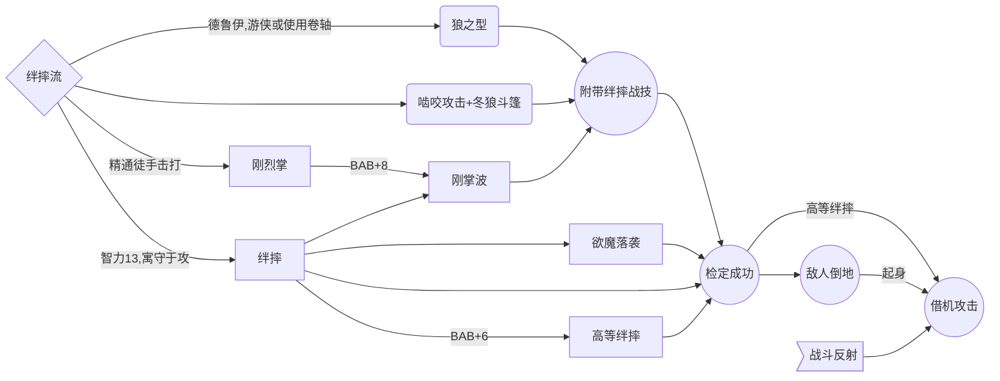
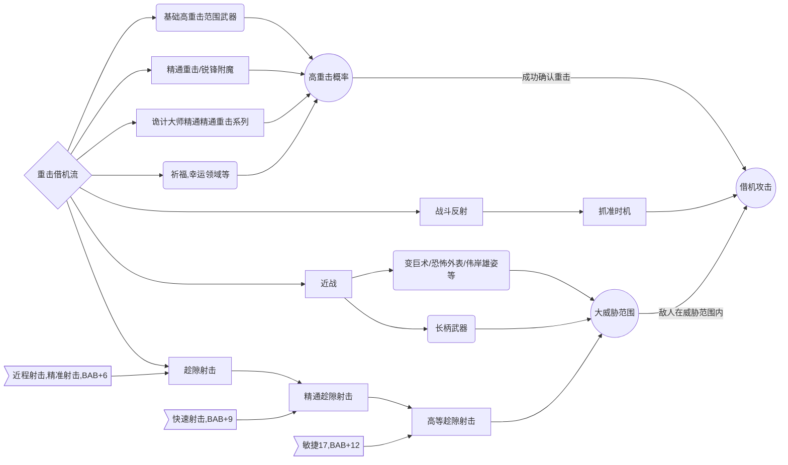
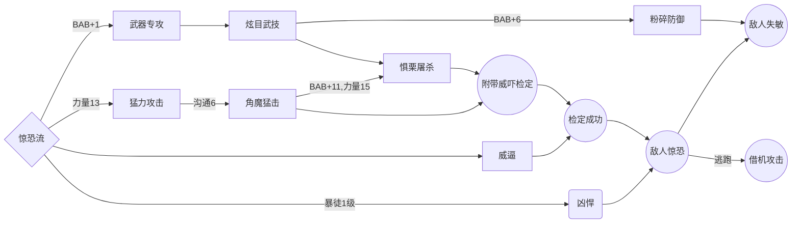
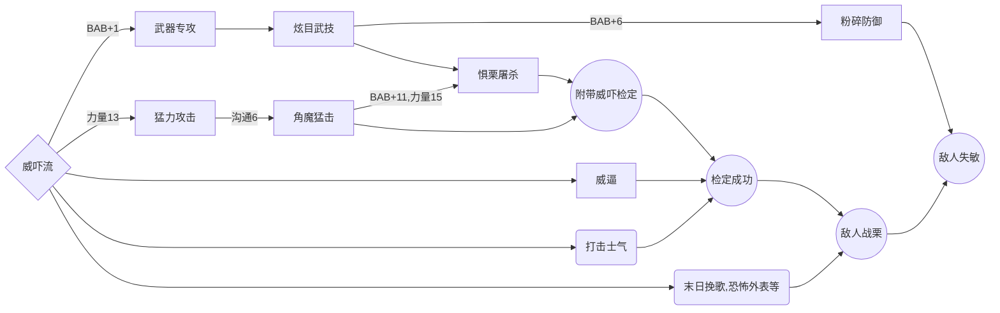
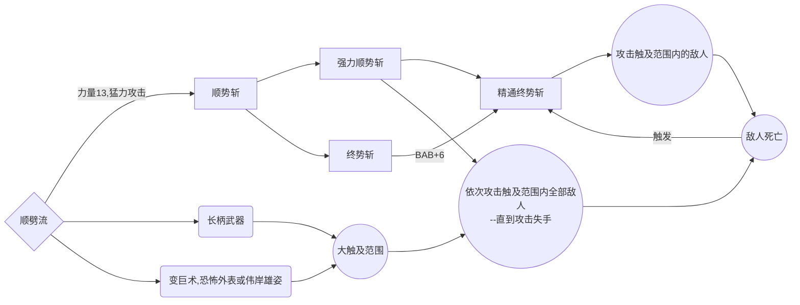
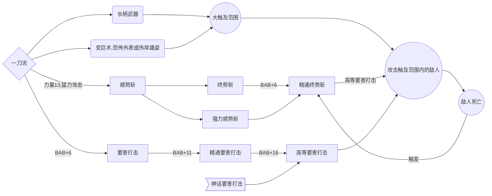
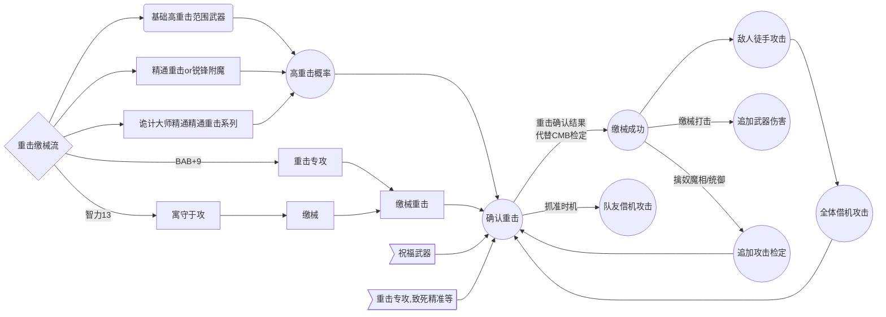

# 拥王者&正义之怒——全专长整理、玩法解析和测评
11月18号更新神话专长和神话能力测评

**制作者：aaathl  or 唯行**

正义之怒&拥王者的交流群：一群487092507、~~二群：972953691（**推荐**，二群聊游戏比较多）~~、2.5群：191268357

持续更新中—— 有问题或补充可以在群里@我

**GITHUB链接** ---[正义之怒主角BD收录](https://github.com/ZJUZBW/Wotr-BD-LR)

**GITHUB链接** ---[正义之怒物理职业测评](https://github.com/ZJUZBW/WotR-CA)

**GITHUB链接** ---[正义之怒队友BD收录](https://github.com/ZJUZBW/-Wotr-BD-)

**GITHUB链接** ---[拥王者&正义之怒全专长测评](https://github.com/ZJUZBW/Wotr-AofF)

**GITHUB链接** ---[正义之怒施法者入门和进阶手册](https://github.com/ZJUZBW/Wotr-AofS)

**GITHUB链接** ---[【新人向】属性、命中（AB）、防御（AC）和豁免的堆叠及法术对抗](https://github.com/ZJUZBW/Wotr-BUFF)

**百度贴吧**：[【正义之怒不公平战报】【无佣兵无修改】魔能射手+全剧情队友](https://tieba.baidu.com/p/7974312458)

**哔哩哔哩**：[【正义之怒不公平视频录制】【无修改】恶魔法师](https://www.bilibili.com/video/BV1Bu411C7xR)（视频太麻烦了，目前就更新到第二章虫群女王之前，而且版本比较旧了，上面的文字战报思路和教学性更好，可以结合观看）

**百度网盘**：https://pan.baidu.com/s/15jx_JzQDWn4_kcxlLRdegg 提取码：wotr，【注：不会实时更新】

## 目录(显示不出来就到网盘下载)

[TOC]


## 前言

**鄙人从2020年开始接触拥王者，陆续已经有2500+小时的游戏时间（拥王者1000+，正义之怒1500+），期间还花了几百小时来逛贴吧和水群——搜集游戏攻略和BD思路。随着对前人的BD和攻略的深入了解和实践，渐渐发现：强力的肉搏BD万变不离其宗，无非就是强力主职业+几大专长流派组合+绝世神兵。而一个BD最关键的就是专长点法，比如：1僧19剑圣，一个简简单单的BD，但是根据属性开卡和专长流派的选择，有几十种不同的玩法，强度也是天差地别。因此决定整理一下全专长，整理出真正核心且强力的专长，帮助新人有目的地根据职业的额外专长数量和职业特性来选取相应的专长流派，来自己构筑BD或者了解一个BD的玩法思路和选择某专长的原因**

***正义之怒+拥王者全专长都有收录并加以评价***

符号释义：【】表示注释、职业能力或种族特性，（）表示补充说明/或者，<>表示装备/武器，[ ]表示法术，” "表示专长，^WotR^表示在正义之怒里新增的。

## **游戏里专长这么多，那么到底什么专长才是强力、什么专长应该优先选择？**

这里我直接给结论：决定专长优先级的，是**稀缺性**和**基本价值**

#### **稀缺性**：

- 专长扩展了某些机制，想要获得这些机制，除此专长之外几乎别无他法。**对于大部分职业来说**，比如精通重击、顺势斩系列、双武器战斗系列、包抄、战斗反射、抓准时机、高等绊摔、威逼、快速射击、多重射击、粉碎防御、猛击终结、突刺^WotR2.0.5^等；对于法师来说就是增效超魔、升阶超魔、顽强超魔（目前主线的DLC3里有权杖了）、甄选超魔（目前主线的DLC3里有权杖了）、法术专精等；
- 专长给的属性在游戏里非常稀缺，比如精通先攻和神话精通先攻，先攻在游戏里是稀缺资源，价值非常高。对于部分职业的优先级极高。比如突刺^WotR2.0.5^，加5触及范围，触及范围在游戏里也是极为稀缺的资源，本身价值也很高。

#### **基本价值：**

- 一个专长，最少要能提供1AB 或 1AC 或 2豁免 或 4先攻 或 2伤害 或 1DC，才算基本合格，记为模板专长。
- 超过模板专长强度的专长，才称得上有强度，比如鹤型拳（等价2AB和1AC），比如精准射击（等价4AB），比如解法余波/暴力解法（各等价2DC，法系打BOSS不可能不解法的）。

**对于一个远程射手**：

- 最优先的任务就是能单点击杀敌人，而且远程伤害基础是非常低的，所以对于远程来说，伤害是稀缺资源（前期），增加伤害的专长就有优先级。
- **所以远程射手的专长优先级为**，精准射击＞加伤害专长（快速射击、多重射击、熟练偷袭者、武器专精、致命瞄准） ＞精通先攻＞其他专长

**对于一个近战双手长柄菜刀**：

- 由于力双手伤害模板，基础伤害是最高的，而且由于攻击距离远，不用特别在意AC，对力双手菜刀来说，增加攻击次数就有极高的收益，所以顺势斩、强力顺势斩、终势斩、精通终势斩、包抄、战斗反射、精通重击、抓准时机就有极高的优先级。而且双手武器点猛力攻击的收益极高，所以猛力攻击也是必点；正义之怒2.05版本可以选择突刺^WotR2.0.5^专长了，+5触及范围对于大力哥也很关键。
- 由于顺势斩和终势斩+借机流的存在，力双手长柄武器菜刀，事实上就是一个最暴力的输出模板，把你队伍里全部加AB和伤害的buff/职业能力都给他就行了。

**其实结论很简单，专长的最佳用法，是用来获得额外机制、获得稀缺资源的。对于不同的职业专长加点的优先级不同；就算是相同的职业，由于队伍搭配和在队伍中的定位不一样，专长加点也是有区别。**

## 核心战斗专长汇总

**【核心专长的定义：能以此为核心而构筑强力玩法的专长，每一个都能实现人物强度的质变。】**

粉碎防御、战斗反射、包抄、抓准时机、刚掌波（利用游戏bug，不限制武器为徒手）、缴械重击（有待实测）、（高等）绊摔+欲魔落袭、鹤形拳、角魔猛击（有时候会无视敌人心智免疫）、强力顺势斩、高等要害打击+精通终势斩、猛力攻击、精通重击、擅长异种武器、精通精通重击全系列（正义之怒的诡计大师道途限定）、突刺^WotR2.0.5^。

## 强力战斗专长流派（组合）及其思路

### 绊摔流

【**又称绊摔借机流**】



**绊摔流关键专长：战斗反射、绊摔、高等绊摔、欲魔落袭、刚掌波**

*绊摔流先决/过渡专长：寓守于攻、精通徒手击打、刚烈掌*

**为何强力？**

1. 倒地的敌人无法行动，且受到近战攻击AC-4，敌人起身动作会引起借机攻击。
2. 绊摔可以附带在整轮攻击（全力攻击）里，不会影响正常的输出。
3. 由于"欲魔落袭“，绊摔战技是所有战技里战技加值最好堆的。
4. 拥王者里大部分敌人都不免疫绊摔，且战技防御不高；正义之怒里绊摔流要发挥的话更加困难，因为恶魔的战技防御非常高，而且新增机制：飞行特性免疫绊摔，恶魔大多数都有翅膀，所以免疫绊摔。
5. "高等绊摔"，在绊摔检定成功以后可以对敌人进行一次借机攻击。

**绊摔战技融入整轮攻击的方法：**

1. 啮咬+<冬狼斗篷>，啮咬会附带一次绊摔战技
2. “刚掌波”，整轮攻击的第一次攻击命中时附带一次绊摔战技
3. [狼之型]，可以用迅捷动作释放绊摔战技

### 借机流

**【又称重击借机流】**



**重击借机流关键专长：抓准时机、战斗反射、包抄、精通重击（拥王者里有锐锋附魔可以不点，正义之怒里神话精通重击需要精通重击作为先决条件）**

**远程重击借机流额外专长：趁隙射击^WoTR^、精通趁隙射击^WoTR^、高等趁隙射击^WoTR^**

**额外需要：高重击范围武器（18~20）×2，超大的威胁范围（比如长柄武器+变巨术/伟岸雄姿+突刺^WotR2.0.5^）或超高攻击次数**

**为何强力？**

1. **很多情况下，一次成功的确认重击并不能击杀敌人**。比如敌人有护命可以免疫重击的额外伤害、装备和专长未成型导致重击倍率低、自身可重击翻倍的伤害低（尤其是一些敏系菜刀）......
2. 重击搭配抓准时机，一些拥有高重击范围（且高攻击次数）但是**重击伤害不高的敏系（双持）队友就可以给其他队友提供额外的借机攻击来迅速秒杀敌人**（作为借机攻击提供者）。
3. **远程攻击**重击搭配抓准时机，**同样可以给其他队友提供额外的借机攻击**（作为借机攻击提供者）；额外搭配高等趁隙射击+[伟岸雄姿]，远程武器刚好拥有23尺的威胁范围{5-2+10+5+5 = 23}，开启近程射击以后将射程锁定至30尺，射程和威胁范围大部分重合，只要敌人妄图突袭后排，基本上都可以威胁到它。差不多可以当成23尺触及的近战使用了。
4. **不需要夹击和集火目标也可以触发借机，只要威胁范围重合即可（远程另算）。**
5. 配合高重击范围的武器，可以实现全队借机攻击次数极大增强。比如3个近战+1个弓手的队伍，近战有30%的重击概率（祈福以后就是51%），每轮攻击5次，远程每轮攻击7次，重击概率10%（祈福以后就是19%）。都点出抓准时机以后（远程额外点出趁隙射击系列），每轮平均增加的攻击检定次数为：3×3×51%×5+1×3×19%×7=  27次攻击（这里还没算上终势斩提供的额外攻击）；非常的恐怖和强力，搭配诡计大师道途的专长，可以到一轮80次以上(或达到每轮借机攻击次数上限为止)的借机攻击，敌人只要没有免疫重击，基本上被碰到就是死。
6. **某些力双手斩矛BD，拥有极高的单次伤害和超大威胁范围，但是受限于攻击次数低，刚好可以作为借机攻击的接受者（单次伤害高，所以额外攻击次数收益极高），在队友重击以后，自己也借机攻击一次，顺便将残血敌人击杀触发终势斩，形成绝对的绞肉机防线。**
7. **众所周知，重击流很怕护命，但是重击借机流刚好与之互补，打护命敌人也是吊打，而且与附伤流也非常契合（借机攻击都可以附伤）。**
8. **玩法通用性非常大**。因为唯一克制该玩法的【免疫重击】，基本上都是种族特性，只有集群、虚体和晶簇等无弱点的生物才可能会拥有，大部分敌人最多只有高等护命（75%伤害免疫重击和偷袭的额外伤害，对重击借机流没影响）。【注：拥王者里免疫重击表现为100%护命，重击以后只是没有额外伤害，但是队友可以借机攻击；而正义之怒里免疫重击就没有重击检定了，触发不了借机攻击】
9. **重击借机流只有最低限度的专长要求即可成型：即抓准时机和战斗反射。**

### 惊恐流

**【注：因为战斗节奏过于拖沓，一直在追击敌人的路上，又称跑跑流】**



**核心专长：角魔猛击、威逼、惧栗屠杀**

**必须额外搭配：1级暴徒的【凶悍】、粉碎防御、超高的移速或者降低敌人移速的能力**

*先决/过渡专长：炫目武技、武器专攻、猛力攻击*

**为何强力（仅限拥王者玩法）？**

1. 拥王者里大部分敌人都不免疫战栗和惊恐，甚至很多强力BOSS都会被惊恐。
2. 惊恐状态下，敌人只会逃跑，不能施法和攻击，还会降低豁免检定，基本上相当于游戏里最强的控制之一。
3. 学了角魔猛击以后，所有攻击附带沟通检定，不免疫惊恐的敌人可以被控到死；搭配惧栗屠杀，击杀敌人以后自动使用炫目武技造成30尺大范围惊恐，敌人毫无还手之力。
4. 搭配粉碎防御，敌人AC会失去敏捷加值和闪避加值，可以降低大量AC。
5. 敌人逃跑的时候脱离队友的威胁范围，还会引发借机攻击。

**详细可以看专长分类评价：威吓流**

### 威吓流



**核心专长：粉碎防御**

**可额外搭配专长：角魔猛击、威逼、惧栗屠杀**

**额外搭配法术/能力：打击士气/末日挽歌/恐怖外表**

*先决/过渡专长：炫目武技、武器专攻*

**为何强力（仅限拥王者）？**

1. 拥王者里大部分敌人都不免疫战栗，甚至很多强力BOSS都会被战栗。
2. 搭配粉碎防御，敌人AC会失去敏捷加值和闪避加值，可以降低大量AC（在拥王者里敏系和天防敌人比较多，一般都能降敌人5~20AC）
3. 角魔猛击有BUG，目前可以无视部分敌人的心智免疫造成战栗（具体敌人未测试），这个东西就有点离谱了。

**详细可以看专长分类评价：威吓流**

### 顺劈流



**核心专长：强力顺势斩、精通终势斩**

*先决/过渡专长：顺势斩、终势斩*

**这个系列尤其适合搭配斩矛、突刺^WotR2.0.5^使用。**

**为何强力？**

1. 游戏里顺势斩不需要敌人相邻，而是对你触及范围内的所有敌人都攻击一次（只要没失手），所以前期3级点出强力顺势斩甚至可以一轮打出十几次攻击检定（在正义之怒里经常可以做到），轮伤直接400+，前期可以秒杀任何专长流派或法术。
2. 终势斩是最优秀的增加攻击次数的手段而且是满BAB的攻击，对于高伤害的双手职业来说收益极高。终势斩的攻击检定如果重击，还能配合"战斗反射"让队友借机攻击敌人，如果自己靠重击杀了敌人，还能继续触发终势斩。

**详细可以看专长分类评价：特殊攻击类**

### 一刀流（要害打击+终势斩）



**核心专长：高等要害打击、精通终势斩**

*先决/过渡专长：顺势斩、终势斩、强力顺势斩、要害打击、精通要害打击*

正义之怒里额外搭配专长：要害打击（神话）

**这个玩法比较花，需要的专长太多了 ，一般是顺劈流的BD后期转过来玩，关键是用要害打击击杀敌人以后，触发的终势斩也是要害打击。要害打击在拥王者里没啥用，但是在正义之怒里有神话要害打击的加成，要害打击的伤害非常恐怖：4倍基础伤害（可重击翻倍的）+1倍附伤，而且这个要害打击还能重击继续翻倍，后期能轻松达到300-3000的单次伤害，配合终势斩的高等要害打击可以瞬间清屏。比较适合这个玩法的神话道途为诡计大师（必定20骰+超高重击范围+超高重击倍率）**和~~御衡者（可以将标准动作变成移动动作使用，一轮可以用两次要害打击）~~【注：御衡者这个能力暂时不能一轮用两个要害打击，等修复】。

**详细可以看专长分类评价：特殊攻击类**

### 重击缴械流^WotR^

注：待实测，现在想到最适合的应该是恶魔道途+原怒者（拿到免疫疲劳以后就可以恶魔狂怒+狂暴一起开了）



**核心专长：重击专攻、缴械重击**

借机攻击必备专长：战斗反射

*先决/过渡专长：寓守于攻、缴械*

**为何强力？**

1. 只有使用天生武器的敌人无法被缴械，被缴械的敌人基本失去了战斗力，若没有“精通徒手击打”，在队友的威胁范围内进行徒手攻击后还会引起借机攻击。
2. 可以在重击后自动附加，不会影响正常的输出。
3. 缴械重击以后的缴械检定，是用重击确认的投掷结果代替战技检定，配合祝福武器和重击专攻，缴械战技投掷结果相当于AB+24或以上（如致死精准等），而且AB显然比战技检定（CMB）要好堆的多。
4. 可以搭配的玩法很多，搭配恶魔道途的擒奴魔相或者统御，甚至可以多次循环触发，而且在循环链中还能多次触发队友的借机攻击（敌人徒手攻击、重击+抓准时机）。搭配阿尔多瑞6级职业能力【缴械打击】，缴械成功后会追加一次武器伤害（除了力量调整值加成以外，包括全部附伤）。
5. 重击缴械流无需配合，也适合队伍里菜刀较少的情况。

**详细可以看专长分类评价：重击类**

## 菜刀Build的专长选择模板

**根据以上的强力专长流派可以看出，专长的主要作用是扩展机制，实现原来做不到的玩法。所以对于菜刀来说，专长是非常宝贵的，能点出多少个强力流派，基本上决定了一个BD的物理能力强度。**

新手一看到这么多专长，不知道该如何选择，我这里**提供1个我认为最强的关键专长通用模板（力双手）**，不喜欢可以不用。

**1级点出猛力攻击、3级前点出战斗反射、5级点出包抄、7至9级点出粉碎防御（仅限拥王者）、7级至11级点出抓准时机，9级至11级点出精通重击**（*拥王者里职业带锐锋附魔的可以酌情考虑，正义之怒里力双手BD必学精通重击*）。期间还要点其他专长就要靠职业送的额外专长了。中BAB职业9级左右可以出突刺，满BAB职业6/7级出突刺，本身拿长触及武器的可以暂缓。

**需要注意的是，借机攻击都是满BAB攻击，命中比BAB达到6、11、16带来的额外连击（连击BAB分别为BAB-5，BAB-10，BAB-15）高得多**，因此一个BD多强、输出多高，BAB带来的攻击次数是次要的（正常来说，面对强敌，BAB-10和BAB-15的攻击基本上没啥命中率），**能额外多打几次满BAB的攻击（绊摔借机、重击+抓准时机的借机、缴械的借机、终势斩、机会主义者的借机、两仪回风、气力额外攻击）才更关键的。**

**一个职业送的战斗专长越多，就能在保证基本战力的同时，点出越多的强力战斗专长流派，因此也就越强了。**但是不要为了专长而去兼职，这样就是舍本逐末了，主职业选的强根本不太需要兼职——乱兼职很可能到最后反而没纯职强。只有那些中BAB，且不能穿中甲/重甲的职业打近战，可能需要在前期兼职1级传统武僧/鳞甲之拳来保证5级点出包抄，顺便拿点AC和额外专长。

**这里列举一个原版（拥王者/正义之怒）的全流程强力Build，只要你会加buff，实际体验过游戏流程以后就知道这个BD有多强力----魔战士的核心在于可以灵活应对各种各样的敌人，低接触防御的敌人就用空间斩、低措手不及的敌人就用远见打击、虚体敌人就用幽冥附魔、还有破敌刀锋附加万物破敌、打集群可以用AOE法术和石肤减伤和火焰/阴影护盾反伤、打施法者敌人可以必定在敌人施法时借机攻击（16级的反击），还可以自己加大部分的buff，可以说魔战士就是主角模板（而剑圣则是主角模板中的主角模板，弱化施法+攻守兼备，兼职武僧以后基本上就是爽局），玩起来绝对上瘾。**

```
拥王者的纯职剑圣，这套就是超级砍王了，武器是大蛇王子（+3烈酸毁灭斩矛），后期附魔成+5锐锋幽冥破敌烈酸毁灭斩矛，剩下一个点数可以附魔三元素之一
开卡：人类19力12敏10体16智10感10魅，升级以后加点5力，武器附魔5级开始一直锐锋

---搭配诗人等提供战栗的队友+高上限的专长选择（放弃角魔猛击和威逼）----
1剑圣：猛力攻击、顺势斩、自选武器（斩矛）——送武器专攻
3强力顺势斩、【奥法精准】
5炫目武技、终势斩
6【持久刀锋】
7包抄
9粉碎防御
11盲斗、精通终势斩 ---拥王者里的盲斗有特殊价值的
12【空间斩】
13精通先攻
15高等武器专攻（斩矛）、【破敌刀锋】
17武器专精（斩矛）、高等武器专精（斩矛）
18【幽冥刀锋】
19奥术打击/自选


===========以下为旧版加点=================
1鳞甲之拳19剑圣
开卡：人类18力14敏12体15智7感14魅，升级以后加点1智4力。
守序善良开局，拿到武僧等级以后就随便了，只要是善良阵营能吃到圣武士施恩即可；守序善良还能再吃到勇士赐福加成，比较强力。
如果想玩非善良，就把感知和魅力对调，鳞甲之拳换成传统武僧，这样前期意志豁免会非常高。

------以下为拥王者---------------------------
----懒人版专长选择（不玩瞬发核弹--瞬发强极效地狱烈焰射线）
1剑圣：猛力攻击、顺势斩、自选武器（斩矛）——送武器专攻
2鳞甲之拳：战斗反射
以下都是剑圣
3强力顺势斩
4【奥法精准】---攻坚的时候搭配狐之狡黠一共+5AB，非常好用
5包抄 ——队友专长也要跟上
6角魔猛击
7炫目武技、【持久刀锋】
9粉碎防御
11抓准时机 ——队友专长也要跟上
12终势斩
13精通终势斩、【空间斩】——到这里就算成型了，后续专长可以自己酌情选择。

15盲斗 --有炼金术士给回声定位就不用
16【破敌刀锋/瞬发魔法/远见打击】
17威逼
18超魔（法术延时）
19精通先攻【瞬发魔法/破敌刀锋】
20 --拿到绝对先攻，神功大成

----搭配诗人等提供战栗的队友+高上限的专长选择（放弃角魔猛击和威逼）：
注：拥王者里其实可以不出远见打击和空间斩，武器用大蛇王子（+3烈酸毁灭斩矛，附魔以后变为+5烈酸毁灭公正幽冥破敌斩矛）
然后拿到奈落之眼，自身使用的全部法术自动延时超魔，这样后期记5个高等隐形术、5个战法转换就是常驻了。
1剑圣：猛力攻击、顺势斩、自选武器（斩矛）——送武器专攻
2鳞甲之拳：战斗反射
以下都是剑圣
3强力顺势斩
4【奥法精准】
5包抄  ——队友专长也要跟上
6终势斩
7炫目武技、【持久刀锋】
9粉碎防御
11抓准时机  ——队友专长也要跟上
12精通终势斩
13盲斗 --有炼金术士给回声定位就不用、【空间斩】/【虔诚刀锋】——到这里就算成型了，后续专长可以自己酌情选择，我下面随便举几个玩法。
			
---A---搭配宗师之杖瞬发核弹+整轮攻击的玩法，一般没意义，给九环人用宗师之杖才是正道啊。
15塑能专攻
16【瞬发魔法】
17塑能专精（地狱烈焰射线）
18超魔（法术延时）
19精通先攻、【破敌刀锋】
20 --拿到绝对先攻，神功大成
			
---B---正统魔战士玩法，当成自buff战士，常态物理输出更高，奥术打击+4、（高等）武器专精+4。
15超魔（法术延时）/奥术打击
16【破敌刀锋】
17武器专精 
18高等武器专精 
19精通先攻、【虔诚刀锋】/【幽冥刀锋】
20 --拿到绝对先攻，神功大成
```

**再搭配一个保姆向的剑圣在游戏全程所需的关键buff**

注：重叠的法术请自己鉴别，荆棘之躯、曙光护盾和吸血影障主要是用于对抗集群，其他还有部分buff是针对特定敌人的。

| 环位 | 所需buff：加粗的表示自己拥有                                 | 需要卷轴或注入         |
| ---- | ------------------------------------------------------------ | ---------------------- |
| 1环  | **护盾术、脚底抹油、变巨术、魔化武器**^WoTR^、法师护甲、虔诚护盾、 |                        |
| 2环  | **牛之蛮力、鹰之威仪/枭之睿智、镜影术、朦胧术、**猫之迅捷、狐之狡黠、树肤术、施恩术 |                        |
| 3环  | **移位术、加速术、高等魔化武器^WoTR^、**英雄气概、共同延缓毒素、共同抵抗能量、祈祷术、魔化盔甲、共用识破隐形 | 荆棘之躯               |
| 4环  | **曙光护盾、高等隐形术、石肤**、共同防护能量、行动自如、防死结界、圣战之刃 | 神能、回声定位         |
| 5环  | **吸血影障**、共用石肤、荣光爆发、真知术、维生气泡^WoTR^     | 回声定位               |
| 6环  | **真知术、战法转换**、高等英雄气概                           | 金鹰之魂               |
| 7环  | 勇士赐福、伟岸雄姿                                           | 寒冰之躯^WoTR^         |
| 8环  | 神圣灵光/秩序护盾                                            | 恐怖外表、高等天使之貌 |
| 9环  | 预警术、英雄祈神                                             | 火焰之躯               |


## 专长分类评价

**粗略评级：**强无敌＞核心专长（战斗专长流派的核心，围绕它来点其他专长）＞必出（某些玩法必出的专长，比如远程必出快速射击）=强力/可选（表示专长很强力，但是非必选，需要酌情选择）＞及格（1专长换1AB或1AC算及格）＞无用（低于及格线的专长）

**注意：评级后面还有详细评价，请结合使用。因为是一个人测评的，所有总有一些玩法会没考虑到，评级不一定准确。**

### 战斗专长

#### 远程射击专长

**总评：远程射击专长没什么好评价的，基本上收益都挺高，专长多的可以考虑全部都点出来；专长不够的，根据自己的需求来选择即可。精通精准射击克制那些自带隐蔽效果的敌人和朦胧术，拥王者里很多妖精和魔法兽都自带隐蔽（远程不靠精通精准射击的话，只能用回声定位克制，真知术对这些隐蔽效果无效），没有回声定位的远程射手，点出这个很好用。**

| 远程专长           | 先决条件                                  | 专长效果                                                     | 评价                                       |
| ------------------ | ----------------------------------------- | ------------------------------------------------------------ | ------------------------------------------ |
| 近程射击           | 智力3                                     | 使用远程武器对30英尺内的目标进行的攻击和伤害检定获得+1加值。 | 必出                                       |
| 精准射击           | 智力3、近程射击^1^                        | 你对正处于近战状态的敌人射出或投掷远程武器时，攻击检定不再承受通常的-4减值 | 必出                                       |
| 快速射击           | 智力3                                     | 使用远程武器进行整轮攻击时，你可以在本轮以最高加值额外攻击一次。使用快速射击时，所有攻击检定承受2减值。 | 必出                                       |
| 多重射击           | BAB+6、快速射击                           | 使用弓进行整轮攻击时，你的第一次攻击会射出两箭。如攻击命中，则两箭均命中。此次攻击只可造成一次精准基础伤害(例如偷袭)和重击伤害。复合弓在高力量调整值下带来的伤害加值应用于每一发箭矢，其他伤害加值(如游侠宿敌加值)亦是如此。每支箭矢的伤害减免和抵抗分开计算。 | 必出                                       |
| 致命瞄准           | 智力3、敏捷13、BAB+1                      | 你可以选择使所有的远程攻击检定受到-1的减值以换取伤害+2。你的BAB每+4，减值再-1，伤害再+2。你必须在攻击检定前选择使用本专长，效果持续到你的下一轮。本专长对于接触攻击或不造成HP伤害的攻击无效。 | 强力(正义之怒里某职业缺AB可以不出这个专长) |
| 趁隙射击^WoTR^     | 近程射击^1^、精准射击、BAB6               | 在持用远程武器时，你可以威胁到你近战触及范围内的格子【注：本来中体型就是5尺天生触及，游戏里算法问题，基础武器给的+2触及要减去，所以给的威胁范围变成了3尺】。你可以用该远程武器发动借机攻击。你在发动借机远程攻击时，不会引发借机攻击。 | 强力                                       |
| 精通趁隙射击^WoTR^ | 近程射击^1^、趁隙射击、快速射击、BAB+9    | 你用“趁隙射击”威胁的区域增加5英尺。                          | 强力                                       |
| 高等趁隙射击^WoTR^ | 近程射击^1^、精通趁隙射击、BAB+12、敏捷17 | 你用“趁隙射击”威胁的区域增加5英尺。此外，当你用远程武器发动借机攻击并命中时，你的伤害检定获得+2加值，该次攻击中确认重击的检定获得+2加值。当你拥有+16基础攻击加值时，这些加值提高到+4，当你拥有+20基础攻击加值时，这些加值提高到+6。 | 强力                                       |
| 集束射击           | 近程射击^1^、精准射击、BAB+6              | 当你采取整轮攻击行动，对同一目标进行多次远程武器攻击时，先将所有伤害结果加总，再计算一次目标的伤害减免（DR）。【注：游戏里实际效果为，远程武器整轮攻击里只有第一次攻击计算DR，其他攻击均无视DR】 | 强力                                       |
| 贴身射击           | 战士4、武器专精（远程）                   | 选择一类远程武器，在敌人的威胁范围内使用选定远程武器攻击时，不再会触发借机攻击。 | 强力                                       |
| 精通精准射击       | 敏捷19、BAB+11、近程射击^1^、精准射击     | 你可以忽略目标身上任何非完全隐蔽的失手率。完全隐蔽在对抗你的攻击时，给予正常效果。 | 强力                                       |

#### 基础战斗专长

**总评：猛力攻击、食人鱼打击、寓守于攻、闪避、武器专攻，这五个专长都有其必要性，其他专长则收益一般（作为专长的及格线），属于专长实在多的不行的时候才点。**

| 模板类专长   | 先决条件              | 专长效果                                                     | 评价                                                         |
| ------------ | --------------------- | ------------------------------------------------------------ | ------------------------------------------------------------ |
| 武器专攻     | BAB+1、对应的武器擅长 | 使用所选武器进行的所有攻击检定均获得+1加值。                 | 及格：武器专攻是粉碎防御和炫目武技的先决条件，但是本身属性一般。 |
| 盔甲专攻     | 对应的盔甲擅长        | 选择一种盔甲。其提供的防御等级加值+1。                       | 及格：也只有塔盾专精战士才会点这个专长了，后期强力T都是不穿甲的。 |
| 盾牌专攻     | 擅长盾牌              | 盾牌提供的防御等级加值+1。                                   | 及格：一般点这个专长的都是盾击流，塔盾专精战士也会点。       |
| 高等武器专攻 | 武器专攻、战士8       | 使用所选武器进行的所有攻击检定均获得+1加值，可与武器专攻的加值叠加。 | 及格：拥王者里专长非常富裕可以出；正义之怒里可以搭配武器专攻（神话），所以属于战士之类的必出专长吧。 |
| 高等盾牌专攻 | 盾牌专攻、战士8       | 你使用的盾牌，其提供的防御等级加值+1，可与盾牌专攻的加值叠加。 | 及格：专长非常富裕可以出                                     |
| 猛力攻击     | 力量13                | 用1AB换2近战伤害。用双手武器、双手握持的单手武器、附加1.5倍力调的主要天生武器时，该伤害加值增加50%。如果使用副手武器、次要天生武器攻击、伤害加值减50%。当BAB达到+4以及之后每个+4的倍数时，额外承受-1减值，同时伤害多加2。 | 菜刀必出专长，猛力攻击基本上就是大部分菜刀BD的主要伤害来源之一，尤其是对于双手握持武器的，猛力攻击的收益很高（20BAB情况下，减6AB加18伤害）。而且猛力攻击还是顺势斩、角魔猛击的先决专长。 |
| 食人鱼打击   | 敏捷13、武器娴熟      | 持用轻型武器或其他可以运用武器娴熟的武器时，用1AB换2近战伤害。如果使用副手武器、次要天生武器攻击、伤害加值减50%。当BAB达到+4以及之后每个+4的倍数时，额外承受-1减值，同时伤害多加2。 | 强力：战士、杀手等满BAB职业玩双持流可以点这个专长。游荡者双持则一般不出这个专长。游戏里和双斩专长有互动，点出双斩以后，副手武器也有1倍加成（而非0.5倍）。 |
| 寓守于攻     | 智力13                | 你可以选择在进行近战攻击检定和战技检定时承受-1减值，以使防御等级获得+1闪避加值。当BAB达到+4以及之后每个+4的倍数时，额外承受-1减值，同时闪避加值多提高+1。你只可以在使用近战武器进行攻击或整轮攻击时使用该专长。该专长的效果持续到你的下回合。 | 纯T的玩法基本必出这个专长，1AB换1AC。代价很大，点出这个专长以后，正常来说就不要想打什么伤害了。可以与猛力攻击/食人鱼打击一起开，但是AB会低到无法忍受。 |
| 闪避         | 敏捷13                | 防御等级获得+1闪避加值。失去防御等级的敏捷加值，也会使你失去此专长带来的该效果 | 及格：鹤型拳的先决条件，本身效果也还凑合，算的上主T必出专长了。不像盾牌专攻或盔甲专攻一样还要用特定装备。 |
| 随手投掷     | 智力3                 | 投掷泼溅武器时，攻击检定获得+1环境加值。                     | 及格：职业会送的，自己不会选。                               |
| 武器专精     | 武器专攻、战士4       | 使用所选武器进行的所有伤害检定均获得+2加值。                 | 及格：比较适合双持武器的BD，专长多出来可以考虑一下。         |
| 高等武器专精 | 武器专精、战士12      | 使用所选武器进行的所有伤害检定均获得+2加值，可与武器专精的加值叠加。 | 及格：比较适合双持武器的BD，专长多出来可以考虑一下。         |
| 穷追猛打     | BAB+6                 | 当你进行整轮攻击，连续击中同一目标时，每一击都可造成额外伤害，伤害等于本回合之前已连续击中该目标的次数。该伤害可因重击而翻倍。 | 及格：计算这个专长的收益之前，先考虑自己的队伍有多刮痧，**连续命中**N刀以后敌人还没死。一般双持、武僧和射手的攻击次数比较多，专长多了可以点出这个加一点点伤害。收益真的不高（按照连续命中5刀计算，每次攻击平均+2伤害，难道队友都在刮痧？）。 |


#### 威吓流

**总评：威吓流有两套核心，一个是搭配【凶悍】的AOE惊恐流（简称惊恐流），由于惊恐的敌人不会攻击、不会施法，只会跑，控制能力很强，但是自己的移速不够的话很容易追不到敌人，导致战斗时间特别长，比较适合武僧这种跑得快+绊摔的BD使用；另一个就是以粉碎防御为核心，如果不喜欢惊恐敌人的，点出”粉碎防御”即可，不搭配【凶悍】的“角魔猛击”、“威逼”和“惧栗屠杀”仅仅是造成战栗，有很多方法可以代替，比如诗人、歌者的【末日挽歌】，法/牧的‘可怖外表’，高沟通检定队友的【打击士气】。**

| 威吓流   | 先决条件                           | 专长效果                                                     | 评价                                                         |
| -------- | ---------------------------------- | ------------------------------------------------------------ | ------------------------------------------------------------ |
| 威逼     | 无                                 | 进行用于威吓的沟通技能检定时，除魅力调整值外，将力量调整值也添加在内。 | 搭配角魔猛击使用，后期大力哥一般有13点以上的力量调整值，收益极高。 |
| 炫目武技 | 武器专攻                           | 持用你为“武器专攻”专长选定的武器时，你可以花费整轮动作表演一套高超的武学技巧。进行一次沟通(威吓)检定，以打击30英尺内能够目击到你表演的所有敌人的士气。【注：游戏里不限制使用的武器】 | 本身作用一般，在大部分BD里仅作为粉碎防御的先决条件。搭配【凶悍】可以在游戏前期造成AOE惊恐，对于特殊玩法有用。 |
| 粉碎防御 | 武器专攻、炫目武技、BAB+6、智力3   | 在这一轮中，你击中的战栗、惊恐或恐慌的对手，在你的下一回合结束前都会对你的攻击措手不及。此效果也包括你在这轮中发动的任何额外攻击。【注：游戏里不限制使用的武器】 | 威吓流的核心专长之一，措手不及的敌人失去敏捷的AC加值，敏系敌人能减5-20点AC，非常强力。 |
| 角魔猛击 | 猛力攻击、沟通等级6                | 使用“猛力攻击”专长对敌人造成伤害时，可立刻以自由动作进行一次沟通(威吓)检定，从而打击敌人的士气。 | 懒人必备，每次攻击附带打击士气。搭配【凶悍】相当于全游戏最强控制之一，不免疫心智、战栗或惊恐的对手就是待宰羔羊，一路追着砍。角魔猛击的关键在于你必须先击中敌人一次才能威吓敌人+粉碎防御打措手不及，而有时候敌人不措手不及的话，你根本不好击中它。 |
| 惧栗屠杀 | 猛力攻击、炫目武技、BAB+11、力量15 | 当你将一个敌人的生命值减少到0或更低时，作为自由动作，你可以进行沟通(威吓)检定，以打击30英尺内所有敌人的土气。只有既能看到你，也能看到那个生命值被降到0或更低的目标时，敌人才会受影响。【注：游戏里不限制使用的武器】 | 这个专长的意义在于搭配【凶悍】使用造成AOE惊恐，拥王者里敌人大部分都不免疫战栗和惊恐，靠这个COMBO可以轻松通关。技能特效是炫目武技的特效，挺带感的，值得一提的是：这个AOE战栗比可怖外表早4级，而且队伍里不一定会带诗人。 |

【凶悍】：当暴徒成功使用沟通，打击一名生物的士气后，战栗状态的持续时间提高1轮。另外，如果目标陷入战栗状态至少4轮，暴徒还会使其陷入惊恐状态1轮。

#### 徒手流派专长

**总评：徒手流派专长只有龙形拳流派是仅适合徒手攻击，鹤型拳流派和刚烈掌流派都有部分专长是不限制徒手的。拥王者里最强流派之一：刚掌波绊摔流就是出自于此；鹤形拳很强，白鹤亮翅的效果则见仁见智了。**

| 徒手流派专长 | 先决条件                                          | 专长效果                                                     | 评价                                                         |
| ------------ | ------------------------------------------------- | ------------------------------------------------------------ | ------------------------------------------------------------ |
| 龙形拳       | 力量15、智力3、灵巧等级3、精通徒手击打            | 使用该流派时，你在对睡眠，麻痹和震慑效应进行豁免检定时获得+2加值。在各轮中第一次进行徒手击打的伤害检定时，你可以附加1.5倍的力量加值。 | 本身效果一般，主要是作为龙威的先决专长。                     |
| 龙威         | 力量15、灵巧等级3、精通徒手击打、龙形拳、震慑拳   | 你在使用龙形拳时，徒手击打的伤害检定获得额外1/2力量加值，从而使首次攻击的力量加值翻倍，其他攻击的力量加值变为1.5倍。使用该流派时，若造成重击或使用震慑拳成功震慑对手，还能令对手陷入战栗状态，持续轮数等于1d4+你的力量加值。 | 龙拳僧核心，后期大概能给拳头加6-10点伤害。                   |
| 龙吼         | 力量15、灵巧等级8、精通徒手击打、龙形拳、震慑拳   | 你每天额外获得一次使用震慑拳的机会。使用龙形拳时，你可消耗两次震慑拳机会，以标准动作发出一道冲击力极强的龙吼，影响15英尺锥形范围。锥形范围内的生物受到你的徒手击打伤害，陷入战栗状态1d4轮。目标意志豁免成功(DC为10+1/2你的角色等级+你的感知调整值)可免除战栗 | 无用：武僧攻击次数多，用这个挺亏的。不过这个是必中，有待开发玩法。 |
| 刚烈掌       | 精通徒手击打、BAB6/两仪回风、智力3                | 效果：当你以整轮攻击或两仪回风对单一目标进行多次徒手击打时，先将所有伤害结果加总，再计算一次目标的伤害减免。该能力只适用于徒手击打，无视其他能力。【注：游戏里实际效果为，徒手整轮攻击里只有第一次攻击计算DR，其他攻击均无视DR】 | 配合武僧**【破山击】**可以无视敌人的全部伤害减免（DR）。破DR能力非常好。 |
| 刚掌波       | 刚烈掌、绊摔、精通徒手击打、BAB+9/武僧5           | 当你使用刚烈掌对单个目标进行整轮攻击或使用两仪回风时，如攻击命中，你可通过自由动作进行一次绊摔战技检定。 | 绊摔流核心专长。这个东西有BUG，不限制武器。                  |
| 天将奔烈     | 刚烈掌、BAB+12/武僧8                              | 作为你冲锋动作的一部分，你可以在冲锋结束时进行全力攻击或发动两仪回风。只有在你所有的攻击都满足对单一目标施展刚烈掌的条件时，你才能以这种方式使用天将奔烈。 | 强力：限制徒手攻击版本的猛扑，回合制里很好用。               |
| 鹤形拳       | 闪避、精通徒手击打、智力3、BAB+2/武僧1            | 采取防御式攻击时，攻击检定只承受2减值。当你使用此流派并进行防御式攻击或使用全力防御动作时，防御等级获得额外的+1闪避加值。 | 强力：但凡想要提高AC的角色，点出鹤形拳准没错，而且不需要徒手攻击也能触发。等效2AB和1AC，血赚。 |
| 白鹤亮翅     | 闪避、精通徒手击打、鹤形拳、BAB+5/武僧5           | 以至少一只手空闲进行防御式攻击时，你在面对近战攻击时，防御等级获得+4闪避加值。若近战攻击失手时的检定值跟你的AC差额在4以内，则你在自身下一轮开始前失去该闪避加值。【游戏里有bug，不需要空一只手，近战都能触发】 | 强力：尽管触发一次就会消失。但是根据贴吧测评，承受敌人攻击次数2-9次的时候，白鹤亮翅也有相当于2-3.5的AC。 |
| 白鹤还击     | 闪避、精通徒手击打、鹤形拳、白鹤还击、BAB+8/武僧7 | 采取防御式攻击时，攻击检定只承受1减值。若一次近战攻击失手时的检定值跟你的防护等级差额在4以内，你因此失去白鹤亮翅的闪避加值时，该敌人将引发借机攻击。【注：如果敌人攻击失手是由于隐蔽失手率引起，有时候会触发BUG，导致周围队友都借机攻击该敌人】 | 及格：相当于加1ab和有机会借机攻击，至少比高等武器专攻要好一丝丝。那个借机攻击基本上触发不了。 |


#### 特殊攻击类

**总评：要害打击系列与说明不符，额外武器伤害可以重击翻倍，而且游戏里用要害打击击杀敌人以后的终势斩也是要害打击，所以会有要害打击+终势斩的一刀流清屏玩法**（在拥王者里需要很高的武器骰；正义之怒里有神话要害打击专长，能重击翻倍的伤害也会累加，可以基于此开发玩法，~~御衡者道途后期可以将标准动作变成移动动作，所以还可以一轮用两个要害打击~~）。**顺势斩系列很强，但是一般是搭配长柄武器变巨使用的，用正常武器的不用强行出了，触及小的话玩起来挺难受的。【注：顺势斩和强力顺势斩是前期专长，6级之前都没点出来，就要谨慎考虑这个系列专长了；6级以后标配加速术+敌人血量和体型变大，更多的是整轮攻击搭配终势斩使用】**

| 特殊攻击类   | 先决条件                            | 专长效果                                                     | 评价                                                         |
| ------------ | ----------------------------------- | ------------------------------------------------------------ | ------------------------------------------------------------ |
| 要害打击     | BAB+6                               | 你能以一个标准动作，用最高BAB做出一次可造成额外伤害的攻击。该次攻击扔武器伤害骰两次并相加，之后再加算力量、武器能力（例如〔炽焰〕附魔），基于精准的伤害和其它伤害加值。本专长带来的额外武器伤害在重击时不翻倍，而只加在总值上。 | 即时制下用要害打击系列基本都是亏输出的，唯一作用就是回合制里移动后攻击。但是有一些特殊玩法会用到要害打击。在正义之怒神话要害打击的加持下会有一席之地。 |
| 精通要害打击 | BAB+11、要害打击                    | 你能以一个标准动作，用最高BAB做出一次可造成额外伤害的攻击。该次攻击扔武器伤害骰三次并相加，之后再加算力量、武器能力（例如〔炽焰〕附魔），基于精准的伤害和其它伤害加值。本专长带来的额外武器伤害在重击时不翻倍，而只加在总值上。 | 同上                                                         |
| 高等要害打击 | BAB+16、精通要害打击                | 你能以一个标准动作，用最高BAB做出一次可造成额外伤害的攻击。该次攻击扔武器伤害骰四次并相加，之后再加算力量、武器能力（例如〔炽焰〕附魔），基于精准的伤害和其它伤害加值。本专长带来的额外武器伤害在重击时不翻倍，而只加在总值上。 | 同上                                                         |
| 顺势斩       | 力量13、猛力攻击                    | 以一个标准动作，你可以对攻击范围内的一个敌人以最高BAB进行一次攻击。若命中，在正常伤害的同时，你还能对攻击范围内、与其相邻的另一敌人再进行一次最高BAB攻击。若你这么做，在你下轮动作之前，会遭受AC-2的惩罚。 | 主要是用强力顺势斩                                           |
| 强力顺势斩   | 力量13、猛力攻击、顺势斩            | 你可以用一个标准动作，使用最高BAB对一个近战攻击范围内的敌人进行一次攻击。若命中，则你可以继续对临近前一个敌人的敌人进行攻击，该敌人也同样需在你的触及范围内；如此进行下去。你以此能力对每个敌人仅能攻击1次。当你使用此专长时，你在下轮前AC受-2减值。 | 长柄武器搭配顺势斩系列在前期是非常强力的，游戏里顺势斩不需要敌人相邻，而是对你触及范围内的所有敌人都攻击一次（只要没失手），所以前期强力顺势斩甚至可以一轮打出十几次攻击检定（在正义之怒里），轮伤直接400+。 |
| 终势斩       | 顺势斩                              | 当你进行一次近战攻击，并且将目标的HP降低至0或更低，你可以使用你的最高攻击加值对另一名触及范围内的敌人进行一次近战攻击。你每轮只能利用该专长进行一次额外攻击。 | 前期用终势斩就够了，如果能成功击杀，就能多一次满BAB攻击，非常实在。 |
| 精通终势斩   | 强力顺势斩、终势斩，BAB+6           | 当你使用“终势斩”时没有每轮次数限制。                         | 终势斩和精通终势斩属于全期都非常厉害的专长，只要你触及大（长柄武器+伟岸雄姿/变巨术）、单次伤害高能抢到击杀，后期还可以连锁击杀N个目标，轮伤可以轻松破千。 |
| 震慑拳       | 敏捷13、感知13、精通徒手打击、BAB+8 | 你必须在投掷攻击骰之前宣告使用此专长（因此，未命中会导致尝试失败）。震慑拳在正常造成伤害的同时，还会强制受到你徒手击打伤害的敌人进行一次DC为“10+1/2你的角色等级+感知修正”的强韧豁免检定。豁免检定失败的防御者将被震慑1轮（直到你的下一轮开始前）。被震慑的人物不能行动，失去AC上的任何敏捷加值，并且AC承受-2减值。每4级你每天可以多尝试一次震慑攻击（见特殊），每轮不能超过1次。构装、泥怪、植物、不死、虚体生物和免疫重击的生物不会被震慑。**特殊说明**：武僧1级时获得“震慑拳”做为奖励专长，即使他不满足所需先决条件。武僧每天可尝试的震慑攻击的次数等同于他的武僧等级，再加上每天每4个非武僧职业等级1次。 | 武僧一级就会送震慑拳，不用自己点。震慑状态是非常强力的控制，可惜震慑拳的DC堆不高，打小怪还行，打BOSS控不住而且会免疫。限定徒手攻击，武僧平时没事可以顺手用来摸奖。 |
| 怒涛碎击     | 精通徒手打击、震慑拳                | 你可以用一个整轮动作来施放一次震慑拳。如果成功，你将不会震慑目标，而是降低其AC，数值为你的感知修正，持续1分钟。该罚值不会与另一次本专长造成的罚值叠加。 | 同上，搭配师范这种主感知的玩法可能会有点用。【游戏里好像有良性BUG，不需要攻击检定和豁免检定就能减敌人AC】 |


#### 战技类

**总评：战技类大部分都没啥用，主要是绊摔特别厉害，其一是被击倒的敌人无法行动（相当于游戏里最强的控制之一）、对抗近战AC-4，敌人起身动作还会引发借机攻击；其二是高等绊摔搭配啮咬+冬狼斗篷（仅限拥王者）、“刚掌波”、‘狼之型’、【扫堂腿】等能力可以在绊摔成功后用主武器借机攻击一次，而且这些搭配都是攻击中自动附加绊摔而不影响正常的整轮攻击，在拥王者里非常强力。**

| 战技类         | 先决条件                               | 专长效果                                                     | 评价                       |
| -------------- | -------------------------------------- | ------------------------------------------------------------ | -------------------------- |
| 绊摔           | 智力13、寓守于攻/豪勇念力              | 此专长使角色获得了施展绊摔战技的能力。施展此战技时的战技检定获得+2加值，防御此战技时的战技防御亦获得+2加值。你可尝试绊摔对手，这个动作将取代近战攻击。如果你的战技成功，目标会被击倒。如果目标的腿多于两条，则它每多一条腿，战技攻击检定的DC便+2。有些生物——如泥型怪物、无腿生物以及飞行生物——无法被绊摔。 | 强力                       |
| 高等绊摔       | 智力13、寓守于攻/豪勇念力、绊摔、BAB+6 | 进行绊摔检定时获得+2加值。此加值可与绊摔提供的加值叠加。成功绊摔对手后，可对该对手发动借机攻击。正常：敌人被绊摔时不会触发借机攻击。 | 强力                       |
| 欲魔落袭       | 绊摔                                   | 使用绊摔攻击时，向战技加值（CMB）添加敏捷加值。              | 强力                       |
| 击破盔甲       | 智力3、猛力攻击、力量13                | 此专长使角色获得能施展击破战技的能力。施展此战技时的战技检定获得+2加值，防御此战技时的战技防御亦获得+2加值。你可以试图剥离敌人身上穿着的盔甲。如果你的战技成功，那么目标在1轮内失去盔甲加值。你的攻击每超过目标的战技防御5点，持续时间便增加1轮。 | 无用                       |
| 高等击破盔甲   | 猛力攻击、力量13、击破盔甲、BAB+6      | 进行击破检定时获得+2加值。该加值可与击破盔甲提供的加值叠加。击破成功时，减值持续1d4轮，你的攻击每超过目标的战技防御5点，持续时间便增加1轮。 | 无用                       |
| 缴械           | 智力13、寓守于攻/豪勇念力              | 此专长使角色获得了施展缴械战技的能力。施展此战技时的战技检定获得+2加值，防御此战技时的战技防御亦获得+2加值。你可以用标准动作，试图对近战范围内的敌人发动缴械。如果你的战技成功，那么目标1轮内无法使用他的武器。你的攻击每超过目标的战技防御5点，缴械状态就多持续1轮。 | 仅作为“缴械重击”的先决条件 |
| 高等缴械       | 智力13、寓守于攻/豪勇念力、缴械、BAB+6 | 进行缴械检定时获得+2加值。该加值可与缴械提供的加值叠加。缴械成功时，减值持续1d4轮，你的攻击每超过目标的战技防御5点，持续时间便增加1轮。 | 无用                       |
| 阴招           | 智力13、寓守于攻/豪勇念力              | 此专长赋予角色施展阴招战技的能力。它还会为施展该战技的战技检定(CMB)提供+2加值，并为抵抗它的战技防御(CMD)提供+2加值。你能够花费标准动作，尝试在近战中对敌人造成妨害。如果攻击成功，目标获得减益状态。减益状态只能为以下3种之一：目盲、纠缠和恶心。该状态持续1轮。你的攻击每超过对手的战技防御5点，减益状态便额外持续1轮。 | 无用                       |
| 高等阴招       | 智力13、寓守于攻/豪勇念力、阴招、BAB+6 | 进行阴招检定时获得+2加值。该加值可与阴招提供的加值叠加。阴招成功时，减值持续1d4轮，你的攻击每超过目标的战技防御5点，持续时间便增加1轮。 | 无用                       |
| 冲撞           | 智力3、猛力攻击、力量13                | 此专长使角色获得了施展冲撞战技的能力。施展此战技时的战技检定获得+2加值，防御此战技时的战技防御亦获得+2加值。冲撞会试图将敌人往后推开，而不造成任何伤害。如果你的战技成功，目标会被推出5英尺远。你的攻击每超过对手的战技防御5点，距离便额外增加5英尺。除非你拥有高等冲撞专长，否则被冲撞推走的敌人不会因此移动而触发借机攻击，除非你掌握高等冲撞专长。你无法将生物推入存在固态物体或障碍物的区域。 | 无用                       |
| 高等冲撞       | 猛力攻击、力量13、冲撞、BAB+6          | 对敌人进行冲撞检定时获得+2加值。该加值可与冲撞提供的加值叠加。当你对敌人进行冲撞时，他的移动可使你和你的盟友获得一次进行借机攻击的机会。 | 无用                       |
| 防御式战斗训练 | 无                                     | 在计算你的战技防御时，将你的总生命骰数（HD）视为你的基础攻击加值（BAB）。 | 无用                       |


#### 用敏捷代替力量的专长(敏系专长)

**总评：优雅系列的敏上伤在游戏里基本上属于刮痧，限定单手握持一是只有1倍敏捷/力量调整值的伤害加成和1倍的“猛力攻击”伤害加成（双手握持则是1.5倍敏捷/力量调整值的伤害加成和“猛力攻击”伤害加成）；二是不能双持武器，攻击次数又不高。相当于既没有双手的高额单次伤害也没有双持的额外三次副手攻击。真正的敏上伤还是要看游荡者的【巧计训练】、剑爵的【灵巧剑击】和正义之怒里的神话专长“武器娴熟（神话）”，这些敏上伤不限定单手握持。**

【注：优雅系列不仅有敏上伤的能力，还能使选择的武器视为娴熟武器（即使原来没有），可以敏上AB。比如长剑本来没有娴熟武器词条，所以不能敏上AB，但是选择了优雅挥砍（长剑）以后，使用长剑既能敏上伤又能敏上AB】

| 敏系专长 | 先决条件                                      | 专长效果                                                     | 评价                                                         |
| -------- | --------------------------------------------- | ------------------------------------------------------------ | ------------------------------------------------------------ |
| 武器娴熟 | 无                                            | 使用符合你的体型级别的轻型武器、精灵曲刃、穿甲剑或细剑时，你的攻击检定可以用敏捷调整值取代力量调整值。 | 游荡者一级送武器娴熟，只有不兼职游荡者的敏系菜刀才会自己点。敏系近战必出 |
| 优雅刺击 | 智力3、武器专攻（单手穿刺）、武器娴熟、敏捷13 | 效果：选择一种轻型或单手穿刺武器(如细剑)。当单手持用你选择的武器时，你可以将你的敏捷调整值而非力量调整值附加到武器伤害上。当你以双武器作战，施展两仪回风，或另一只手被占用的其他任何情况下，你都无法获得此专长带来的好处。【特殊：持用小圆盾的时候可以敏上伤】 | 优雅系列专长限定单手握持，比较适合那种不兼职游荡者/剑爵拿【巧计训练】/【灵巧剑击】的职业。 |
| 优雅挥砍 | 智力3、武器专攻（单手挥砍）、武器娴熟、敏捷13 | 效果：选择一种轻型或单手挥砍武器(如长剑)，当你单手持用你所选择的武器时，可以将其视为一种单手穿刺近战武器，藉此使用所有需要这类武器的专长和职业能力(如决斗家的精准刺击)，并且你还可以将你的敏捷调整值加到武器伤害上，取代原先的力量调整值。该武器必须符合你的体型。【特殊：持用小圆盾的时候可以敏上伤】 | 同上                                                         |
| 灵巧战技 | 冲撞、阴招、缴械、绊摔、击破盔甲              | 效果：在决定你的战技加值时，将你的敏捷加值添加到基础攻击加值与体型加值上，不再使用力量调整值。正常：决定你的战技加值时，将力量调整值添加到基础攻击加值与体型加值中。 | 这个加值可以与欲魔落袭的绊摔敏捷加值叠加。所以敏捷人的绊摔检定也是非常高的。不过敏系一般不玩绊摔，可惜。 |


#### 擅长类

**总评：擅长类基本上就是“异种武器擅长”和擅长坐骑装甲值得自己花专长点出，其他的都是靠职业送。拥王者里不兼职武僧，但是要用”刚掌波“绊摔的只能手动点出”精通徒手击打“，正义之怒里背景会送”精通徒手击打“，所以不用自己点。**

| 擅长类                                 | 先决条件         | 专长效果                                                     | 评价                                                         |
| -------------------------------------- | ---------------- | ------------------------------------------------------------ | ------------------------------------------------------------ |
| 擅长异种武器                           | BAB+1            | 擅长一种异种武器                                             | 强力专长。穿甲剑、精灵曲刃和斩矛，算得上异种武器三大幻神，无关版本。拥王者里决斗剑还行，成型快后期也凑合。 |
| 精通徒手击打                           | 智力3            | 即使亳无武装，你也被视为持用武器。你的徒手攻击可以造成143点钝击伤害(此为体型为中型的情况。小型则为1d2点)。 | 作为鹤形拳、刚掌波等专长的先决条件，不会主动点出来，一般靠兼职武僧来获得。 |
| 盔甲擅长（轻、中、重型坐骑装甲）^WoTR^ | 动物伙伴1、动物1 | 你的动物伙伴擅长对应的坐骑装甲，擅长重型坐骑装甲的先决条件是擅长中型坐骑装甲。 | 动物伙伴可以自己点擅长盔甲而不是坐骑装甲，目前人用盔甲比坐骑装甲厉害多了。 |
| 擅长军用武器                           |                  | 擅长军用武器                                                 | 一般是靠职业（兼职）送的，不会主动用专长点出来               |
| 擅长塔盾                               | 擅长盾牌         | 擅长塔盾                                                     | 一般是靠职业（兼职）送的，不会主动用专长点出来               |
| 擅长盔甲（轻、中、重型盔甲）           | 看说明           | 擅长对应的盔甲，擅长重甲的先决条件是擅长中甲，擅长中甲的先决条件是擅长轻甲。 | 一般是靠职业（兼职）送的，不会主动用专长点出来。动物伙伴可以点一级擅长轻甲。 |
| 擅长盾牌                               |                  | 擅长盾牌                                                     | 一般是靠职业（兼职）送的，不会主动用专长点出来               |


#### 近战施法类

**总评：解法余波和暴力解法非常强力，主角法师基本上是必出的，队友的话则视情况而定，奥术打击还行，但是优先级不高。**

| 近战施法类     | 先决条件            | 专长效果                                                     | 评价                                                         |
| -------------- | ------------------- | ------------------------------------------------------------ | ------------------------------------------------------------ |
| 战斗施法       | 智力3               | 释放法术或类法术能力而进行的专注检定+4加值                   | 无用                                                         |
| 披甲奥术训练   | 智力3               | 因穿着盔甲造成的奥术失败率降低10%                            | 无用                                                         |
| 披甲奥术大师   | 智力3、披甲奥术训练 | 因穿着盔甲造成的奥术失败率降低20%，此加值取代披甲奥术训练给的加值，而不是叠加 | 无用                                                         |
| 扰乱施法^WoTR^ | 智力3、战士6/奥术   | 距离你10尺内的所有敌人防御式施法的专注检定DC+4               | 无用                                                         |
| 解法余波^WoTR^ | 无                  | 如果你将敌人身上的一个持续性魔法效果成功解除，该敌人再一轮内抵抗你的法术的豁免检定承受-2减值 | 必出：对于高CL的施法者来说，瞬发（高等）解除魔法，解除敌人buff同时还可以降敌人2豁免。 |
| 奥术打击       | 智力3、奥术         | 每轮消耗一个迅捷动作，将自己一部分的力量注入武器中。在1轮内，你的武器造成的伤害+1，穿透伤害减免时视为魔法武器。你每有5个施法者等级，此加值就+1，在20级时达到最高值+5 | 强力：奥术近战可选，满CL的话，最后可以加5伤害，效果很可观。  |
| 暴力解法^WoTR^ | 无                  | 当你对敌人的目标型解除魔法检定成功时，该敌人必须成功进行强韧豁免检定（DC=10+1/2施法者等级+施法属性调整值），否则震慑到你的下个回合开始。如果豁免成功,敌人改为陷入恶心1轮。 | 必出：对于恶魔道途法师、合书人、御衡者来说，这个暴力解法的DC非常高，而且每解除一个BUFF就需要检定一次，经常能够震慑敌人，恶心可以减敌人2点全豁免也是极强。 |


#### 双持+盾击系

**总评：双持和盾击系专长没啥好说的，想玩这个流派的就是必出。双持需要额外4专长换3次副手攻击（减2AB，单次攻击伤害低，成型慢），相当于双手点出顺势斩系列专长（单次攻击伤害高，前期顺势斩很强且顺势斩和终势斩都是满BAB的攻击；当然玩双手武器也可以不出顺势斩系列，加快其他专长成型），孰强孰弱，见仁见智了。盾击系对比双持系，还要额外付出三个专长，伤害上限反而不如双持，除了盾牌AC以外就是靠猛击终结来玩套路了。总体来说，双持还是可圈可点，盾击基本上属于下水道玩法，只有后期空降佣兵或洗点玩还不错**

| 双持盾击系     | 先决条件                                     | 专长效果                                                     | 评价   |
| -------------- | -------------------------------------------- | ------------------------------------------------------------ | ------ |
| 盾击           | 智力3、擅长盾牌                              | 你可以使用轻型盾牌和重型盾牌进行攻击。如果你的另一只手里拿着武器，则此行为会承受双武器战斗减值。轻型盾牌造成1d4点伤害，并视为轻型武器。重型盾牌造成1d6点伤害，并视为单手武器。 | 看总评 |
| 猛击终结       | 擅长盾牌、盾击、BAB+11、盾牌大师、双武器战斗 | 当你用近战武器造成重击的时，你可以使用同样的加值，以自由动作对同一个目标进行盾击。 | 看总评 |
| 盾牌大师       | 擅长盾牌、盾击、BAB+11、双武器战斗           | 当你使用另一件武器时，你不会受到盾牌造成的攻击检定减值。将你的盾牌的增强加值加到盾牌造成的攻击和伤害检定上，就如同它是武器增强加值一样。 | 看总评 |
| 双武器战斗     | 敏捷15、智力3                                | 效果：使用两把武器进行攻击检定时的减值降低。主手武器的减值减少2，副手武器的减值减少6。正常：如果你在副手持有第二把武器，那么你每轮可以用该武器进行次额外攻击。使用这种方式战斗时，你的常规攻击或主手武器的攻击承受6减值，而你的副手武器攻击则承受10减值。如果副手武器为轻型武器，则主手与副手的减值皆减少2。徒手击打总是被视为轻型武器。 | 看总评 |
| 双斩           | 敏捷15、双武器战斗                           | 效果：使用副手武器进行伤害检定时，添加力量调整值。正常：使用副手武器进行伤害检定时，只能添加一半的力量调整值。【注：游戏里与食人鱼打击有互动，食人鱼打击的副手伤害加成也变成1倍而不是0.5倍；值得一提的是，双持飞斧不需要这个专长】 | 看总评 |
| 精通双武器战斗 | 敏捷17、BAB+6、双武器战斗                    | 你可以用副手武器进行第二次攻击，但需承受-5减值               | 看总评 |
| 高等双武器战斗 | 敏捷19、BAB+11、精通双武器战斗               | 你可以用副手武器进行第三次攻击，但需承受-10减值              | 看总评 |


#### 重击类

**总评：战技类除了精通重击和缴械重击以外，其他专长的意义不大。正义之怒新增的“缴械重击”附带的缴械用的是重击确认检定结果+4（应该是重击专攻的加值，还可以附加其他的例如夺命姿态的重击确认检定加值），配合祝福武器自动确认重击（重击确认自动20骰），战技检定结果相当于AB+24或24以上，而且AB也比CMB好堆很多，非不公平难度基本上都能必定成功。**只有使用天生武器的敌人不可以被缴械，被缴械的敌人会用徒手攻击，如果没有专长“精通徒手击打”，徒手攻击会引发借机攻击，被缴械的敌人会被疯狂借机而死。重击缴械流最适合的职业是原怒者，因为AB和重击确认骰非常高，而且还有血脉送专长；喜欢决斗剑的可以额外搭配阿尔多瑞防御者的【缴械打击】：成功缴械后可以附带一次武器伤害（附加武器攻击的全部效果，除了力量调整值的伤害），重击确认→成功缴械→缴械打击的连锁，可以极大增强重击的伤害；还可以与恶魔道途的擒奴魔相搭配使用，重击→缴械成功→额外一次攻击检定，如果该攻击重击则→缴械成功→额外一次攻击检定，如此循环。

| 重击类         | 先决条件                       | 专长效果                                                     | 评价                           |
| -------------- | ------------------------------ | ------------------------------------------------------------ | ------------------------------ |
| 精通重击       | BAB+8                          | 选择一个武器种类。使用选定的武器时，你的重击威胁范围加倍。特殊：你可以多次获得精通重击专长，但其效果不叠加。每次获得该专长，都必须应用于新的武器上。此效果不与其他增加武器重击威胁范围的效果叠加。 | 必选专长                       |
| 重击专攻       | BAB+9                          | 重击确认时，攻击检定+4环境加值                               | 及格：仅作为缴械重击的先决专长 |
| 重击掌控       | 战士14、重击专攻、两个重击专长 | 当你重击时，除了如常造成伤害外，还可另外应用两种重击专长的效果。普通：你重击时，除了如常造成伤害外，只能应用一种重击专长的效果。 | 无用                           |
| 力竭重击       | 重击专攻、BAB+15、疲劳重击     | 对目标造成重击时，目标立即陷入力竭状态。对已经陷入力竭状态的敌人无效 | 无用                           |
| 恍惚重击       | 重击专攻、BAB+13               | 重击时，你的对手会陷入恍惚状态，持续1d4+1轮。成功的强韧检定能够减少1轮持续时间。强韧检定的DC为10+你的基础攻击加值。该专长效果不可叠加。再次命中只会增加效果的持续时间1d4+1轮。 | 无用                           |
| 恶心重击       | 重击专攻、BAB+11               | 重击时，你的对手会陷入恶心状态，持续1分钟。此专长效果不可叠加。再次命中只会延长效果的持续时间1分钟。 | 无用                           |
| 疲劳重击       | 重击专攻、BAB+13               | 对目标造成重击时，目标立即陷入疲劳状态。对已经陷入疲劳或力竭状态的敌人无效 | 无用                           |
| 目盲重击       | 重击专攻、BAB+15               | 重击时，你的对手将永久目盲。强韧检定成功能够将此效果削弱为目眩1d4轮。强韧检定的DC为10+你的基础攻击加值。该专长对于不依靠视觉或长有2只眼睛以上的生物无效。目盲可通过医疗术、再生术、移除目盲或类似能力治愈。 | 无用                           |
| 缴械重击^WoTR^ | 缴械、智力13、BAB+9            | 效果：每当你的近战攻击造成重击时，除了正常造成攻击伤害之外，还可以缴械对手。如果你的确认重击检定超过对手的战技防御(CMD)，你可以像发动缴械战技一样将对手缴械，这样做不会引发借机攻击。正常：你必须发动缴械战技才能将对手缴械。特殊：对于一次重击，你只能运用其中一项以下专长的效果：冲撞重击、缴械重击、移位重击、破武重击、绊摔重击。你可以在确认重击检定之后，再选择施展该专长。 | 重击缴械流的核心专长           |


#### 其他战斗专长

**总评：战斗反射、突刺^WotR2.0.5^为近战必出专长，其余专长根据自身玩法选择。**

| 其他             | 先决条件                                                 | 专长效果                                                     | 评价                                                       |
| ---------------- | -------------------------------------------------------- | ------------------------------------------------------------ | ---------------------------------------------------------- |
| 战斗反射         | 无                                                       | 你每轮可获得额外的借机攻击，次数等同于你的敏捷调整值。拥有此专长后，即使处于措手不及状态，你仍可进行借机攻击。 | 借机流核心                                                 |
| 拔挡飞箭         | 智力3、敏捷13、精通徒手击打                              | 你必须有一只手是空的(未持有任何物品)才能使用此专长。每轮次，当你原本应该被远程武器进行的攻击命中时(但这不包括法术效果、天生攻击或大质量的远程武器)，你可以偏开这次攻击且不受任何伤害。你必须有意识到攻击，而且并未陷入措手不及状态。偏开远程攻击不算是一个动作 | 用于不公平难度开局或者铁人模式防止暴毙。                   |
| 拔挡射线         | 盾牌辟矢、敏捷15                                         | 要施展此专长，你必须使用一面轻型盾牌、重型盾牌或塔盾。你将盾牌加值（不包括增强加值）加到你的接触AC上。 | 忠贞的重甲人，可以出这个。                                 |
| 灵活移动         | 敏捷13、闪避                                             | 当你因为离开或进入一个被敌人威胁的区域而受到借机攻击时，你的防御等级获得+4闪避加值。会使你失去防御等级上敏捷调整值的状态(若有)也会让你失去闪避加值。 | 无用                                                       |
| 盾牌辟矢         | 盾牌专攻、敏捷13                                         | 你必须使用盾牌才能使用此专长。每轮一次，当你原本应该被远程武器进行的攻击命中时(但这不包括法术效果、天生攻击或大质量的远程武器)，你可以偏开这次攻击且不受任何伤害，就好像你有拨挡飞箭专长一样。你必须有意识到攻击，而且并未陷入措手不及状态。 | 无用                                                       |
| 阿尔多瑞决斗精通 | 智力3、敏捷13、擅长决斗剑、武器 专攻（决斗剑）、武器娴熟 | 只要你开始战斗时带着决斗剑，你就在先攻检定中获得+2加值。只要你只持有一把决斗剑(即不使用盾牌、副手武器)，你的防护等级便获得+2盾牌加值。虽然决斗剑造成挥砍伤害，但在判定决斗家使用武器的效果时，它也被视作穿刺武器。 | 用决斗剑的阿尔多瑞防御者可以出。                           |
| 盲斗             | 无                                                       | **在近战时，每次因为隐蔽效果而造成的攻击失手，你都能重骰失手率以确定你是否击中**。**不可见的攻击者在近战攻击你时不会获得特殊优势。这就是说你不会失去AC的敏捷加值，对方也无法获得通常隐形下的攻击+2加值**。但是不可见攻击者的远程攻击依然会有上述优势。此外，你在目盲状态下全速移动时无需进行特技技能检定。**盲斗可以免疫凝视攻击。** | 拥王者菜刀必出专长（前提是没有回声定位且不带炼金术士队友） |
| 精通盲斗         | 盲斗、察觉技能10                                         | **你的近战攻击忽略低于全隐蔽的失手率。**你仍旧可以如常重投全隐蔽带来的失手率百分骰。**如果你成功定位30尺内的隐身或躲藏起来的攻击者，该名敌人会失去与使用远程攻击对你进行攻击相关的优势。**即你的AC不会失去你的敏捷加值，并且攻击者不会由于隐蔽而获得通常的+2加值。 | 无用                                                       |
| 高等盲斗         | 精通盲斗、察觉技能15                                     | 你的近战攻击忽略低于全隐蔽的失手率，并且对你来说，**全隐蔽的敌人被视为只有普通的隐蔽**（即20%的失手率而非50%）。你仍旧可以如常重投失手率的百分骰。**如果你成功定位隐身或躲藏起来的攻击者，该名敌人会失去与使用远程攻击对你进行攻击相关的优势，无论彼此的距离为何。**即你的AC不会失去你的敏捷加值，并且攻击者不会由于隐蔽而获得通常的+2加值。 | 无用                                                       |
| 突刺^WotR2.0.5^  | BAB+6                                                    | 近战攻击触及范围+5，AC-2。除了主T，天生小体型缩小（雷吉尔）、中体型微缩雄姿（诡计大师）以外，其他近战都是必出的。 | 强无敌                                                     |


### 团队专长

**总评：团队专长要共同点出来（除非拥有独行战术），且站位合适才会生效。团队专长由于需要队友配合和站位，其效果至少要为一般专长的两倍效果才能算的上强力。比较强的团队专长是包抄，抓准时机，剩下的感觉效果一般，只有送团队专长的职业才会考虑。**

| 团队专长   | 先决条件        | 专长效果                                                     | 评价                                                         |
| ---------- | --------------- | :----------------------------------------------------------- | ------------------------------------------------------------ |
| 协同防御   | 智力3           | 位于带有该专长的队友附近时，你的战技防御获得+2表现加值。如果施放战技的生物大于你和队友，该加值提高至+4 | 无用                                                         |
| 协调战技   | 智力3           | 当你与同样拥有此专长的盟友邻接时，你所有的战技检定获得+2表现加值。当你试图从擒抱中挣脱出来时，此加值增加至+4 | 无用                                                         |
| 摆脱困境   | 智力3           | 每个邻接同伴都使你全豁免+1，上限4                            | 审判官和战士等有独行战术的可以出                             |
| 盾墙       | 擅长盾牌、智力3 | 邻接持盾同伴使你AC上的盾牌加值增加，队友持小圆盾或轻盾给你+1、持重盾或塔盾给你+2 | 及格：前期还行，后期谁会组双重盾/塔盾的前排呢？【注：盾墙的范围据说非常大，可以让后排神术/诗人职业持盾和主T组双盾+盾墙】 |
| 精准打击   | 智力3           | 对夹击目标造成额外1d6偷袭伤害，可以与职业偷袭骰叠加          | 审判官可以出                                                 |
| 持盾施法者 | 智力3           | 每当你邻近一名拥有该专长的盟友，你的专注检定就会获得+4加值。队友持小圆盾或轻盾额外+1、持重盾或塔盾给额外+2 | 游戏里施法者不会在敌人脸上施法，没用                         |
| 结盟施法者 | 智力3           | 若你邻近一名同样拥有该专长的盟友，那么你专注检定和法术穿透获得+2加值。【目前的bug是，有N个人点出结盟施法者，就加2×N的法术穿透，前期点出来可以极大提升游戏体验。后期倒是不缺法穿】 | 如果最高只能+2的话，优先级不如（高等）法术穿透，在正义之怒里堆法穿还是不错的。如果是+2N的话，优先级非常高。 |
| 包抄       | BAB4、智力3     | 夹击额外加2AB，对被夹击敌人重击确认时，队友可以对该敌人借机攻击 | 菜刀5级点出来，游戏难度骤减，前期强力、后期用抓准时机可以代替包抄的借机效果，不缺AB但非常缺专长的职业才会考虑放弃。 |
| 背靠背     | 察觉3、智力3    | 当你遭到夹击且与拥有此专长的盟友邻接时，在对抗夹击你的对手所发动的攻击时，你的AC将获得+2环境加值 | 及格：跟盾墙半斤八两                                         |
| 接力绊摔   | 智力3           | 邻接同伴时对敌人的绊摔检定双骰取高                           | 审判官可以出，效果大概相当于绊摔战技加值+3.5                 |
| 抓准时机   | 战斗反射、智力3 | 拥有此专长的队友对自身威胁范围内敌人重击确认时，可以对该敌人借机攻击 | 借机流核心专长，越多人点出来就越厉害。而且远程攻击对敌人造成重击，威胁该敌人的队友也能对其进行一次借机攻击。 |

### 法师专长

#### 一般法师专长

**总评：没啥好说的，都强力，缺什么就补什么专长。缺法术穿透就补“法术穿透”和“高等法术穿透”、缺CL就选法术专精、缺DC就选（高等）元素专攻和（高等）法术专攻。召唤系属实比较垃圾，就操纵亡者和漫天虫蚀比较好用，看自己需求选择增强召唤和高等召唤。**

| 一般法师专长 | 先决条件         | 专长效果                                                     | 评价   |
| ------------ | ---------------- | ------------------------------------------------------------ | ------ |
| 元素专攻     | 智力3            | 效果：选择一个能量类型(酸蚀、寒冷、电击或火焰)。若要对抗你所选能量类别的法术，其豁免检定难度等级（DC）+1。 | 看总评 |
| 高等元素专攻 | 元素专攻         | 效果：若要对抗你所选能量类别的法术，其豁免检定难度等级+1。此加值可与元素专攻提供的加值叠加。 | 看总评 |
| 法术专攻     | 智力3            | 效果：若要对抗你所选学派的法术，其豁免检定难度等级+1。特殊：你可以多次获得此专长。效果不叠加。每次获得此专长，必须应用于新的魔法学派上。 | 看总评 |
| 高等法术专攻 | 法术专攻         | 效果：针若要对抗你所选学派的法术，其豁免检定难度等级+1。此加值可与法术专攻提供的加值叠加。特殊：你可以多次获得此专长。效果不叠加。每次获得此专长，必须应用于新的魔法学派上，且该学派必须是法术专攻已经选择过的学派。 | 看总评 |
| 法术穿透     | 智力3            | 你在为突破生物的法术抗力进行施法者等级检定时，获得+2加值。   | 看总评 |
| 高等法术穿透 | 法术穿透         | 你在为突破生物的法术抗力进行施法者等级检定时，获得+2加值。此加值可与法术穿透提供的加值叠加。 | 看总评 |
| 法术专精     | 法术专攻         | 效果：选择一个法术。判断该法术所有基于施法者等级的效果时，将你的施法者等级视为比实际高2级每次你在施法职业上获得等及时，你可以选择另一个法术，替换此专长原先选择的法术，而该法术将成为你的专精法术。 | 看总评 |
| 增强召唤     | 法术专攻（咒法） | 你用任何召唤法术召唤出来的生物，在该召唤法术持续的时间内，其力量与体质获得+4增强加值。 | 看总评 |
| 高等召唤     | 增强召唤         | 你每次施展召唤法术，并召唤出1个以上的生物时，召唤生物的总数再+1. | 看总评 |

#### 法术超魔

**总评：法术升阶是施法者必学专长，用于调整法术位和提高DC（比如三环法术位很缺，但是四环法术位很多且四环法术都不好用，就可以把三环法术升阶到四环来用；或者将强力法术如神使灵光、光之锁链、臭云术等法术升阶超魔到九环来提高DC）；法术顽强对于控制/秒杀流玩法也是必出专长；法术增效对于主打法术输出的职业来说几乎是必学的。**法术延时也是不错的专长，延时超魔权杖不够用的话，可以考虑学一个，也可以搭配神话能力偏好超魔使用；

**法术增效、法术强效和法术极效，一般是搭配使用（强效超魔+极效超魔权杖等；极效超魔+强效超魔权杖等；强极效超魔权杖；或者是职业能力强效+极效超魔权杖+增效超魔法术......），塑能法术至少要强效+极效以后才能毁天灭地，不然都是给敌人刮痧；**

| 法术超魔               | 先决条件 | 专长效果                                                     | 评价                                                         |
| ---------------------- | -------- | ------------------------------------------------------------ | ------------------------------------------------------------ |
| 超魔（法术升阶）       | 智力3    | 效果：升阶法术的法术等级比正常法术要高(上限为最高的9级)。与其他超魔专长不同，受法术升阶调整的法术，其有效等级确实会增加。所有取决于法术等级的效果(例如豁免检定DC和穿透法术无效结界的能力)都会根据升阶后的等级计算**【注：为了避免误解，这里法术等级也称法术环位】** | 必出                                                         |
| 超魔（法术及远）       | 智力3    | 效果：你可以调整接触、近距或中距法术的距离，使其距离按接触，近距，中距，远距的顺序提升一级。环位提升：1环 | 无用                                                         |
| 超魔（法术延时）       | 智力3    | 效果：延时法术的持续时间加倍。持续时间为专注、立即或永久的法术不受此专长影响。环位提升：1环 | 强力                                                         |
| 超魔（法术强效）       | 智力3    | 效果：强效法术的所有可变量、数字效果均提升一半，包括掷骰上的加值。豁免检定、对抗掷骰，以及不具有随机变量的法术不受此专长影响。环位提升：2环 | 强力：搭配极效超魔权杖等实现强极效。                         |
| 超魔（法术极效）       | 智力3    | 效果：受此专长调整的法术，其所有的可变量、数字效果皆取最大值。豁免检定、对抗掷骰，以及不具有随机变量的法术不受此专长影响。同时应用强效与极效的法术从两个专长处分别获得其效果：最大值结果，再加上一半的正常掷骰结果【注：然而游戏里并没有这个限制】。环位提升：3环 | 强力：搭配强效超魔权杖等实现强极效。                         |
| 超魔（法术瞬发）       | 智力3    | 效果：施展瞬发法术是一个迅捷动作。你在施展瞬发法术的同一轮仍可以进行其他动作，甚至包括施展其他法术。施展时间为1整轮或超过1轮的法术不可瞬发。特殊：只要法术原本的施法时间不超过1个整轮动作，你便可以将此法术的效果应用于自发施展的法术且无须增加施法时间。环位提升：4环 | 后期可以学，瞬发克敌机先之类的低环法术。一般都是用超魔权杖来瞬发。 |
| 超魔（法术甄选）^WoTR^ | 智力3    | 效果：在施放具有范围效果，且持续时间为立即的法术时，你可以选择其范围内若干个目标，数量等于决定你额外法术的属性调整值(若你是吟游诗人、先知、圣武士、术士或召唤师，使用魅力属性;若你是巫师和法师，使用智力属性;若你是牧师、德鲁伊、审判官或游侠，使用感知属性)。这些目标被该法术的效果排除在外。环位提升：1环 | 看游戏里给不给超魔权杖，给的话就没必要学。                   |
| 超魔（法术顽强）^WoTR^ | 智力3    | 效果：当被顽强法术指定为目标或位于其范围内的生物在对抗该法术的豁免检定中成功时，该生物必须再针对其效果进行一次豁免检定。若生物在第二次豁免检定中失败，则会承受法术的完整效果，如同在第一次豁免检定中失败。环位提升：2环 | 必出                                                         |
| 超魔（法术增效）^WoTR^ | 智力3    | 效果：法术每个伤害骰+2伤害，该伤害可以溅射到目标周围生物，且法术不再附加偷袭骰。环位提升：1环 | 必出。这个超魔给了施法者除了进阶诡术师以外的另一种玩法。甚至比进阶诡术师的增伤能力更强 |


### 职业专属专长

| 职业专长                 | 先决条件                                   | 专长效果                                                     | 评价                                                         |
| ------------------------ | ------------------------------------------ | ------------------------------------------------------------ | ------------------------------------------------------------ |
| 余音绕梁                 | 智力3、吟游演绎                            | 效果：停止表演后，吟游演艺带来的加值和减值仍会持续2轮。仍须满足其他所有条件(如距离和特定条件)效果才能持续。如果你在这时开始新的吟游演艺，则上一次演艺的效果则会立刻消失。 | 必出                                                         |
| 能力专攻-炼金炸弹        | 炼金炸弹、奥法炼金炸弹                     | 针对你的炼金炸弹进行的所有豁免检定DC+2。                     | 炸弹人可以出这个专长                                         |
| 选择导能                 | 魅力13、引导能量                           | 引导正向能量治疗活物或引导负向能量治疗不死生物时，不会影响敌人。引导正向能量伤害不死生物或引导负向能量伤害活物时，不会对队友造成影响。 | 必出                                                         |
| 以战筑信^WoTR^           | 秘示域/领域/使用一环神术                   | 你的先攻检定获得+1加值，专注检定获得+2加值。                 | 无用                                                         |
| 极意击（也译作完美打击） | 精通徒手击打、敏捷13、感知13、智力3、BAB+8 | 你必须在进行攻击检定前事先声明施展本专长(因此攻击检定失败会浪费次数)。你可以骰两次攻击检定并取较高的结果。你每拥有四个等级，每天便可以尝试一次极意击(但有例外情况，见“特殊”段落)特殊：宗射手在1级时获得极意击作为额外专长，即使不符合先决条件。武僧每天可尝试施展极意击的次数等于其武僧等级，在武僧之外每拥有四个其他职业的等级，每天便可多施展一次 | 禅宗射手会送，即时制每次攻击前都要手动释放，用起来很麻烦。其他职业不值得花专长来学。 |
| 熟练偷袭者               | 偷袭1                                      | 你的偷袭伤害提高1d6。你的偷袭骰数不能超过角色等级的一半(四舍五入)。 | 主要是用于进阶诡术师。增伤效果也不错，可选。                 |
| 穿透打击                 | 战士12、武器专攻                           | 你用武器专攻选定的武器进行攻击时，最多可以忽略5点伤害减免。  | 无用（拥王者里没实装，正义之怒里不需要）                     |
| 高等穿透打击             | 战士16、武器专攻、穿透打击                 | 你用武器专攻选定的武器进行攻击时，最多可以忽略10点伤害减免   | 同上                                                         |
| 自然施法                 | 野性变形（狼）、感知13、智力3              | 你在使用野性变身时也可施放法术。你用其他声音跟姿势来替代施法时所需的。 | 玩自然变形的必出这个专长                                     |
| 额外圣疗                 | 圣疗、医者之道                             | 效果：你每天可额外使用2次圣疗。特殊：额外圣疗次数可多次获得。效果叠加 | 无用                                                         |
| 额外奥法池               | 奥法池、精深法池                           | 你的奥法池增加2点。你可以多次获得此专长。其效果可叠加，每次获得此专长时，你的奥法池点数都会增加。 | 无用                                                         |
| 额外导能                 | 引导能量                                   | 你每天引导能量的次数增加2次。特殊：额外导能可多次获得。效果叠加 | 牧师/先知不知道加什么专长就选这个。                          |
| 额外演艺                 | 吟游演绎                                   | 你每天可以额外使用6轮吟游演艺。                              | 无用                                                         |
| 额外炼金炸弹             | 炼金炸弹                                   | 你每天可额外投掷4枚炼金炸弹。                                | 可选                                                         |
| 额外狂暴                 | 狂暴                                       | 效果：你每天可以额外狂暴6轮。特殊：你可以多次获得额外狂暴。效果叠加 | 无用                                                         |
| 额外狂暴特技             | 狂暴特技                                   | 野蛮人解锁了狂暴状态下的新技能。她获得了一个额外的狂暴特技。她必须满足该狂暴特技的所有先决条件。该专长可选取多次。 | 野蛮人变体/原怒者会少几个狂暴特技，需要这个来补。            |
| 额外破敌武器             | 破敌                                       | 你每天可以多施展3轮的审判官破敌武器能力。                    | 可选                                                         |
| 额外血承狂暴^WoTR^       | 血承狂暴                                   | 效果：你每天可以额外血承狂暴6轮。特殊：你可以多次获得额外血承狂暴。效果叠加 | 无用                                                         |
| 魔性之尾^WoTR^           | 狐妖                                       | 你从以下列表中按顺序获得一个新的类法术能力，每个能力每天限用两次：1.渐隐术2.睡眠术3.朦胧术4.隐形术5.沉眠术6.移位术7.困惑术8.支配他人。举例而言，首次选取此专长时，你会获得2次/天的渐隐术;第二次选取此专长时，你会获得2次/天的睡眠术。这些法术的施法者等级等于你的生命骰数。难度等级(DC)基于魅力。 | 九尾狐术士送这个专长，可惜基本都是垃圾能力。                 |
| 好伙伴                   | 动物伙伴                                   | 计算你的动物伙伴的能力时，将你的职业视为比现在高4级，最大有效等级等同于你的角色等级。 | 纯职德鲁伊、木族术士这些职业是满级动物伙伴（职业等级视为德鲁伊等级），不用选这个专长，但是兼职以后还要有满级动物伙伴就需要好伙伴。游侠、牧师的动物伙伴（职业等级-3视为德鲁伊等级）需要靠好伙伴补。 |


### 种族专长

**总评：强力的种族专长就是灵狐猛扑、飞翼、谨慎战斗。**

| 种族专长                 | 先决条件                            | 专长效果                                                     | 评价                                                         |
| ------------------------ | ----------------------------------- | ------------------------------------------------------------ | ------------------------------------------------------------ |
| 元素之拳^WoTR^           | 精通徒手击打、体质13、感知13、BAB+8 | 效果：当你施展元素拳时，从以下能量类型中选择一种：酸蚀，寒冷，电击，火焰。成功命中后，攻击除了造成正常伤害外，还会造成146点所选类型伤害。你必须在进行攻击检定前事先声明施展本专长(因此攻击检定失败会浪费次数)。你每天可尝试一次元素拳，每拥有四个武僧等级，可额外尝试一次，但每轮不能超过一次。 | 放在种族专长里，纯粹是这个专长太废物，且武僧种族变体会送这个专长。 |
| 坚石稳步^WoTR^           | 土巨灵裔                            | 你在灵巧检定上获得+2种族加值，并且可以忽略地底的困难地形。   | 无用                                                         |
| 大地的低语^WoTR^         | 土巨灵裔、石之共鸣、角色等级9       | 你能够感受到15英尺内与地面有接触的所有生物的存在。           | 无用                                                         |
| 天性迷人（吸血裔）^WoTR^ | 魅力17、吸血裔                      | 每日限一次，你可以在下次沟通技能检定中取20                   | 无用                                                         |
| 宴血者（吸血裔）^WoTR^   | 吸血裔、饮血者（吸血裔）            | 施展专长“饮血者"咐时，你的伤害检定获得+2加值，运动检定获得+1加值。上述加值持续轮数等于你的生命骰数的一半。 | 无用                                                         |
| 灵狐猛扑^WoTR^           | 狐妖、BAB+10                        | 狐妖形态下获得猛扑                                           | 强力                                                         |
| 生亡交织^WoTR^           | 吸血裔                              | 你既能够受到用于治疗活物的引导正向能量治疗，也能受到用于治疗不死生物的引导负向能量治疗，但两者均只能够治疗正常数值的一半。你依然会受到用于伤害不死生物的正向能量的伤害，比如引导能量和圣疗效果 | 吸血裔想要方便加血，这个专长还是要点出来的。                 |
| 石之共鸣^WoTR^           | 土巨灵裔                            | 在地底时，你的察觉检定获得+4种族加值，先攻检定获得+2加值     | 无用                                                         |
| 谨慎战斗                 | 半身人                              | 防御式攻击时，你的防御等级获得+2闪避加值。                   | 半身人敏系近战，基本上都会点出来。收益很高。                 |
| 飞翼                     | 神裔、角色等级10                    | 你将获得一对飞翼，使AC在针对近战攻击时获得+3闪避加值，并对例如困难地形的地面效果免疫 | 强力：神裔近战必出专长，翅膀还是帅的，而且效果强力。不过正义之怒里道途会送 |
| 饮血者（吸血裔）^WoTR^   | 吸血裔                              | 每日限三次，你可以从一个昏迷、无助、睡眠或麻痹的活物身上吸血，或者从活物的尸体上吸血。若如此做，你获得5点临时生命值，你每拥有三个生命骰，额外获得5点临时生命值。你还会在强韧豁免检定上获得+1加值。以上效果持续1小时。 | 无用                                                         |
| 钢铁灵魂                 | 矮人、坚如磐石                      | 效果：你在对法术和类法术能力进行豁免检定时获得+4种族加值。此加值取代矮人坚如盘石种族特性带来的加值。普通：矮人在对法术和类法术能力进行豁免检定时获得+2种族加值。 | 无用：豁免来源太多了，不值得用宝贵的专长来换。               |
| 壮胆^WoTR^               | 人类                                | 具有此专长的人类在对抗心智效应的豁免检定上获得+2种族加值。如果该效应同时也是恐惧效应，则加值提高到+4。 | 无用                                                         |
| 奥法专攻^WoTR^           | 精灵                                | 某些精灵家族在培养法师(以及其他奥术施法者)的传统上极为悠久，他们抚养孩子时，认为每个孩子都注定要成为强大的魔法使用者，而对诸如武器运用技术之类的世俗问题没有什么需求。具有此种族特性的精灵在防御性施法的专注检定上获得+2种族加值，用于穿透法术抗力的施法者等级检定获得+1加值。 | 性价比不高，没机会点。                                       |
| 明辨之眼^WoTR^           | 精灵/半精灵                         | 你在对抗幻术法术和效应的豁免检定上获得+2种族加值，在使用魔法装置技能检定上获得+2加值。 | 无用                                                         |
| 精灵之魂^WoTR^           | 半精灵                              | 你拥有精灵种族特性“精灵魔力”，使你在穿透法术抗力时的施法者等级检定上获得+2种族加值。此外，在鉴定魔法物品的特性时，你的知识(神秘)技能检定获得+2种族加值。 | 强力：堆法穿的好东西，可惜一般没多余的专长点。               |
| 铁胃^WoTR^               | 矮人/半兽人                         | 在对抗所有毒素和任何导致反胃或恶心状态的效果时，你的豁免检定获得+2种族加值。 | 无用                                                         |
| 操纵阴影^WoTR^           | 侏儒                                | 具有此专长的角色所施放的阴影法术的施法者等级+2。             | 强力                                                         |
| 生命历练^WoTR^           | 精灵/矮人/侏儒                      | 你的所有知识和学识技能检定获得+2加值。                       | 检定人强力专长                                               |
| 精通精灵免疫^WoTR^       | 精灵/半精灵                         | 你对惑控法术的抗力变得更强，在对抗它们的豁免检定上额外获得+2加值。此外，你施放的惑控法术的DC提高1点。 | 强力                                                         |
| 铁皮^WoTR^               | 矮人/半兽人                         | 你的皮肤异常坚硬，AC获得+1天生防御加值。                     | 及格                                                         |
| 锐利獠牙^WoTR^           | 半兽人                              | 你可以发动啮咬攻击，造成1d4外加力量调整值的伤害。你视为擅长该攻击，能够为其应用专长或适用于天生攻击的效果。如果作为整轮攻击的一部分使用，啮咬被视为次要攻击，以最高基础攻击加值5进行检定，伤害只附加一半力量调整值。 | 用天生武器的BD，可以考虑一下半兽人                           |
| 速学者^WoTR^             | 人类                                | 你每级额外获得一点技能点。                                   | 检定人必学专长                                               |

### 乘骑专长^WoTR^

**总评：主要是不屈坐骑和奋力冲刺非常厉害，其他的一般**

| 乘骑专长     | 先决条件           | 专长效果                                                     | 评价                                                         |
| ------------ | ------------------ | ------------------------------------------------------------ | ------------------------------------------------------------ |
| 不屈坐骑     | 智力3、灵巧5       | 每轮一次，当你的坐骑豁免检定失败时，你可以进行一次灵巧检定。如果你的灵巧检定结果高于敌方攻击的难度等级(DC)，坐骑就可以豁免成功 | 必出：每轮一次，灵巧+d20当作坐骑的豁免，效果绝对是很强的。   |
| 践踏         | 智力3、乘骑战斗    | 你获得在骑乘坐骑时践踏敌人的能力。若践踏成功，你的坐骑对被践踏击倒为俯卧的目标造成伤害，视同它用一次天生攻击击中目标 | 游戏里这个专长效果为：乘骑时动物伙伴可以使用闯越战技——冲过并践踏前方所有敌人（战技检定成功后）。有待开发玩法。 |
| 骑乘战斗     | 智力3、灵巧1       | 每轮一次，当你的坐骑在战斗中被击中时，你可以尝试灵巧检定来抵消这次攻击。如果你的灵巧检定结果高于敌方攻击检定结果，这次攻击就会被抵消 | 每轮一次，灵巧+d20当作坐骑的AC，效果一般。灵巧检定比动物伙伴的AC难堆。 |
| 骑乘盾牌防御 | 骑乘战斗、盾牌专攻 | 你可以将你的基础盾牌加值(包括盾牌专攻的加值，但不包括增强加值)加到坐骑的防御等级(AC)上。 | 不好用，效果还不如护盾术，而且乘骑还持盾就有点呆了。乘骑不用考虑AC，因此通用思路是用双手武器来提高伤害。动物伙伴可以用卷轴加护盾术。 |
| 奋力冲刺     | 骑乘战斗、智力3    | 在骑乘期间采取冲锋行动时，你可以用近战武器造成双倍伤害。     | 骑乘必出：与猛扑有联动，如果猛扑以后每次攻击都是双倍         |


### 检定人专长

**总评：检定人专长没有强弱之分，想堆技能检定就使劲堆，堆到技能检定必定成功就行。**

| 检定人专长 | 先决条件 | 专长效果                                                     | 评价                           |
| ---------- | -------- | ------------------------------------------------------------ | ------------------------------ |
| 善于沟通   | 智力3    | 所有沟通和察觉技能检定均获得+2加值。如果上述两种技能等级为10或以上，此加值提高为+4。 | 无                             |
| 警觉       | 无       | 你在察觉技能检定上获得+2加值。如果你的察觉技能等级为10或以上此加值提高为+4。 | 无                             |
| 瞒天过海   | 智力3    | 所有沟通和巧手技能检定均获得+2加值。若其中某一技能等级达到10级或以上，对该技能的加值提高为+4 | 无                             |
| 灵巧双手   | 智力3    | 所有巧手和使用魔法装置技能检定均获得+2加值。若其中某一技能等级达到10级或以上，对该技能的加值提高为+4 | 无                             |
| 藏踪匿迹   | 无       | 所有灵巧和隐匿技能检定均获得+2加值。如果上述两种技能等级为10或以上，此加值提高为+4 | 无                             |
| 技能专攻   | 无       | 效果：所有与选定技能有关的检定均获得+3加值。如果该技能等级为10或以上，此加值提高为+6。特殊：你可以多次获得此专长。效果不叠加。每次获得此专长，都可添加一个新技能 | 堆技能检定，优先选择技能专攻。 |


### 制作物品专长^WoTR^

| 制作物品专长 | 先决条件 | 专长效果                      | 评价                                                         |
| ------------ | -------- | ----------------------------- | ------------------------------------------------------------ |
| 抄录卷轴     | 智力3    | 露营期间能制造卷轴            | 九环或有强力法术的法系必出的专长，比如法师、萨满、先知、游侠、圣武士都可以出。法师等能抄卷轴学习法术的职业都可以靠这个实现全法表。卷轴专家就此变成超强法师变体。自建人物的话，背景选奥法学者会送。 |
| 调制药水     | 智力3    | 露营期间能制造3级和以下的药水 | 必须是能对他人使用的法术才能制作药水，目标为自身的法术则不行。所以作用不是很大，药水主要用于遭遇战或遇到大驱散以后一轮满buff（喝药是移动动作，用法术/卷轴是标准动作，再瞬发一个法术，一轮可以补三个buff；算上队友的群体buff基本可以补满）。 |


### 其他专长

**总评：游戏里除了精通先攻又特殊用途以外，其他的专长都不值得花专长点出来。**

| 其他专长     | 先决条件           | 专长效果                                                     | 评价                                                         |
| ------------ | ------------------ | ------------------------------------------------------------ | ------------------------------------------------------------ |
| 健壮         | 无                 | 你的HP增加3点，且你的生命骰每比3HD高1级便额外获得1点HP。由生命骰高于3开始，每次你获得一个新的生命骰（例如当你获得一个新的等级）时你都额外获得1点HP。 | 无用，相当于每级+1血量                                       |
| 坚韧         | 无                 | 效果：你的运动检定获得+2加值，对抗疲劳和力竭效应的强韧豁免获得+4加值。你可以穿着轻型或中型盔甲睡眠，而不会陷入疲劳状态【注：游戏里基本无用】。 | 无用                                                         |
| 顽强         | 无【兽人凶猛】特性 | 你极难被击杀。你在生命值低于0时不会直接死亡，而是能够以伤残状态再战斗1轮。你的下个回合结束时，若你的生命值未回到0点以上，你将立刻陷入昏迷。【负血量的绝对值超过体质还是会死亡，一般来说并不能免死而是加速死亡】 | 无用                                                         |
| 钢铁意志     | 无                 | 意志+2                                                       | 无用                                                         |
| 精通钢铁意志 | 钢铁意志           | 意志+2，可以与钢铁意志的加值叠加。                           | 无用                                                         |
| 闪电反射     | 无                 | 反射+2                                                       | 无用                                                         |
| 精通闪电反射 | 闪电反射           | 反射+2，可以与闪电反射的加值叠加。                           | 无用                                                         |
| 顽石强韧     | 无                 | 强韧+2                                                       | 无用                                                         |
| 精通顽石强韧 | 顽石强韧           | 强韧+2，可以与顽石强韧的加值叠加。                           | 无用                                                         |
| 精通先攻     | 无                 | 先攻检定+4                                                   | 对于剑圣、预言学派法师等拥有绝对先攻的职业很有用。对于施法者，堆先攻，每次战斗都第一个出手是非常爽的，先攻高的法师和低的法师完全是天上地下。 |


### 神话道途专长^WoTR^

**总评：诡计大师察觉2阶的专长，基本上每一个的强度都是≥基础职业的20级大招，而且组合起来可以实现质变，11-20（×4~×8）的武器，敌人就跟纸糊的一样。只能用人物自身专长点出来，职业送的战斗专长列表里没有。11级、13级、15级、17级分别可以点出一个，要注意专长的分配**。

| 神话道途专长         | 先决条件                  | 专长效果                                           | 评价   |
| -------------------- | ------------------------- | -------------------------------------------------- | ------ |
| 精通精通重击         | 察觉2阶、精通重击         | 选择一种武器，其重击范围+1（可以被精通重击翻倍）   | 强无敌 |
| 精通精通精通重击     | 察觉2阶、精通精通重击     | 选择一种武器，其重击范围再+1（可以被精通重击翻倍） | 强无敌 |
| 精通精通精通重击精通 | 察觉2阶、精通精通精通重击 | 选择一种武器，其重击倍率+1                         | 强无敌 |
| 超魔（超正常法术）   | 察觉2阶                   | 超魔后的法术环级降低1【可以把1环超魔成戏法无限用】 | 强无敌 |

# 神话专长和神话能力

## **到底怎么样的神话专长和神话能力才是强力、应该优先选择？**

直接给结论：跟专长一样，决定神话专长和神话能力优先级的，是**稀缺性**和**基本价值**

#### **稀缺性**：

- 神话专长和神话能力扩展了某些机制，想要获得这些机制，除此之外几乎别无他法。
  - 真无穷系列：永恒审判、无限狂暴，这两个彻底改变了审判类和狂暴类职业的续航等级，基本上属于最高优先级。
  - 扩展职业机能：第二秘示域、第二血脉、第二血怒者血承和奇迹领域，这些
  - 强化法术数量：
  - 强化能量伤害：正义之怒有几个核心的火系装备（纵火狂之戒、马兰德的耻辱、诡诈烈焰手套），都是加成火系法术伤害的
  - 

- 专长给的属性在游戏里非常稀缺，比如精通先攻和神话精通先攻，先攻在游戏里是稀缺资源，价值非常高。对于部分职业的优先级极高。

#### **基本价值：**

- 一个神话专长，最少要能提供2AB 或 2AC 或 4豁免 或 8先攻 或 4伤害 或 2DC，才算基本合格，记为模板专长。
- 超过模板神话专长强度的神话专长和神话能力，才称得上有强度，比如猛力攻击（神话），比如精通重击（神话）。

## 神话能力分类评价

### 强化职业系列


### 资源加成系列

### 强化特定玩法系列

### 剩余的通用加成系列

